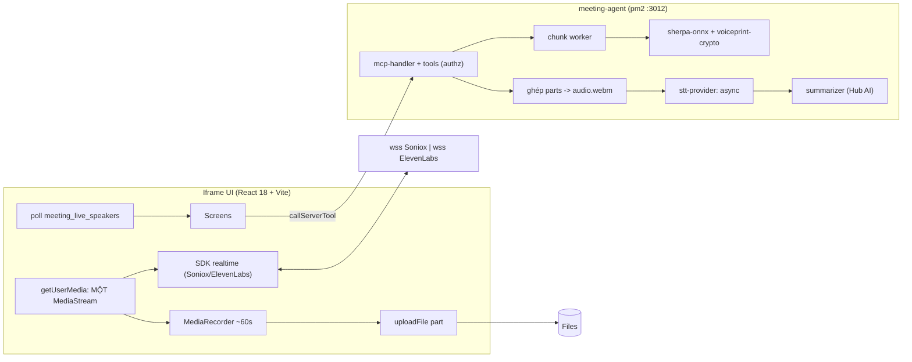

# System Architecture

Nguồn sự thật chi tiết: `plans/260917-1358-…/plan.md`. Tài liệu này tóm tắt kiến trúc
đã hiện thực ở Phase 1 và giữ chỗ cho **kết quả spike** phải điền khi chạy với Hub thật.

## Boot & runtime mode

App boot qua `serveApp` (`@privos_ai/app-server`) trong `src/server/index.ts`. Mode tự
phát hiện, không đặt bằng env:

| Mode | Resolved khi | Transport/trust |
|---|---|---|
| `managed` | có workload socket (`PRIVOS_WORKLOAD_SOCKET`) | serveApp, Hub-signed |
| `standalone-production` | có identity file (`npm run pair`) | serveApp, dispatch trust |
| `development` | không có cả hai và `NODE_ENV`≠production | dev Relay loop, unverified actor |

Boot chạy `assertProviderKeysAtBoot()` (fatal ở production nếu provider đang chọn thiếu
khoá hoặc thiếu `VOICEPRINT_ENC_KEY`) và self-check credential bot. Sau khi handler sẵn
sàng: `startupSweep()` (job/meeting bỏ rơi) và `startAudioRetention()` (P8, mỗi 6h) chạy
fire-and-forget trên mọi phòng trong registry node-local `known-rooms.json` (đọc room-less,
xem `jobs/known-rooms-store.ts`). `SIGTERM`/`SIGINT` được app tự bắt (đăng ký TRƯỚC
`serveApp()`) để `meetingQueue.startDraining()` từ chối job mới và dừng interval retention
ngay lập tức — `serveApp` tự lo phần đóng transport/HTTP server; pm2's `kill_timeout` chỉ
còn phải chờ job **đang chạy** (nếu có) tự xong hoặc tự timeout.

## Backend Hub access (installation bot)

Mọi ghi App DB/job/settings đi qua `POST /api/v1/mcp-apps.tool-call` với credential bot
(`src/server/hub/bot-tool-call.ts` → `callAppPlatformTool`). Mọi call mang `roomId` khi
client có (kể cả collection `scope:'global'` speaker_profiles/app_settings): Hub cấp `db:*`
chỉ ở permission context `room`, nên call phải có roomId mới resolve đúng context — Hub bỏ
qua roomId khi lưu global collection (dữ liệu vẫn dùng chung mọi phòng), roomId chỉ thoả
context. Sweep boot/6h chạy room-less nên đọc danh sách phòng từ registry node-local, không
từ App DB. `resolveOwnMcpAppId()` cấp `mcpAppId` cho body. Iframe chỉ **đọc** App DB để hiển thị.

## Data flow (record → live naming → process → review)

## App DB collections

Nguồn sự thật: `src/shared/app-db-schema.ts` (7 collection). Global: `speaker_profiles`,
`app_settings`. Room: `meetings`, `meeting_speakers`, `action_items`, `bookmarks`,
`processing_jobs`. Field chỉ có `string|number|boolean|date|array|reference`.

## STT provider layer

`src/server/stt/stt-provider.ts` (interface) + `stt-provider-registry.ts` (chọn theo
`app_settings` → env) + bốn vỏ (soniox/elevenlabs × realtime/async). Phase 1 là vỏ; logic
thật ở P2 (realtime token mint) / P3 (async transcribe).

## Speaker identity + voiceprint (P4)

`src/server/speaker/` — mọi module xuất hàm thuần (không gắn vòng đời job), để P5 (live
naming) dùng lại nguyên xi:

- `voiceprint-crypto.ts`: AES-256-GCM + HMAC-SHA256 (`VOICEPRINT_ENC_KEY`, HKDF-derived
  MAC key) bọc mọi embedding trước khi ghi App DB — `openEmbedding` không bao giờ ném lỗi,
  HMAC sai → `null` + log `hmac_mismatch` (QĐ-06).
- `embedding-extractor.ts`: lazy singleton quanh `sherpa-onnx-node`'s
  `SpeakerEmbeddingExtractor`, nạp qua **dynamic import** (package không có `.d.ts` — xem
  `sherpa-onnx-node.d.ts`) và fail rõ ràng khi thiếu model/native addon; `dim` đọc runtime.
- `segment-picker.ts` → `resolve-speakers.ts`: chọn range sạch mỗi speaker, embed **từng
  range riêng** (không nối PCM trước) để tính `minPairwiseCosine` — cụm lưỡng đỉnh (hai
  giọng lẫn một turn) bị chặn enrol tự động dù embedding trung bình có vẻ khớp ai đó.
- `speaker-matcher.ts`: so **từng embedding** (max), không so centroid.
- `profile-store.ts`: CRUD `speaker_profiles` (global, dùng chung mọi phòng; call vẫn mang
  roomId cho permission context), `withProfileLock` +
  re-read trước khi ghi (chặn 2 job ghi đè `embeddings[]`), cap 20 embedding/profile.

Tool: `speaker_resolve` (owner, 4 mode, cổng đồng nhất nội cụm), `speaker_profile_list/_update/_delete`
(`createdByUserId` hoặc admin), `meeting_relabel_speaker` (back-propagate, P7 dùng lại).

## Live speaker naming từ chunk (P5)

Chunk = part 60s P2 đã upload (không thêm luồng audio). `meeting_chunk_ready` xác thực
span (cấu trúc, không audio) rồi enqueue vào `src/server/jobs/keyed-serial-queue.ts` —
khoá theo `meetingId`, backlog "mới nhất + 2", `abort()` đợi child thoát (KHÔNG dùng
`render-queue.ts` của gia phả — không khoá theo key, timeout không dừng việc đang chạy).

`src/server/live-speakers/chunk-worker.ts` (`processChunk`): tải part theo `seq`
(`part-window.ts`) → decode → cắt PCM theo turn (bù ring buffer overlap) → RMS lọc khoảng
lặng (`tools/span-validation.ts`, mặc định RMS — Silero/`sherpa_onnx.Vad` là câu hỏi mở
#9 chưa chốt) → `computeEmbedding` → `session-speaker-registry.ts`. Turn vắt biên part
được **hoãn** (`defer`/`takeDeferred`), không bỏ; dedupe theo `(speaker, startMs)`. Một
chunk lỗi chỉ mất nhãn của chính nó — `noteDecoded` luôn chạy trong `finally` nên đồng hồ
tích luỹ (`decodedSecBefore`) không bao giờ lệch vĩnh viễn.

`session-speaker-registry.ts` (thuần in-memory, theo `meetingId`): nhãn Soniox chỉ là gợi
ý — mọi embedding được so lại với centroid của session speaker đang gắn nhãn đó; nhãn bị
dùng lại cho giọng khác → mở `label@n`, centroid cũ không đổi. Gắn dính (`sticky`) chỉ sau
≥2 lượt và ≥`LIVE_MIN_SPEECH_SEC` giây nói. Hai session speaker hội tụ centroid
(`SPEAKER_SESSION_MERGE_THRESHOLD`) → gộp, bên `speechSec` lớn hơn thắng. TTL 30 phút +
LRU (trần = `LIVE_MAX_CONCURRENT_RECORDINGS`) qua `SessionRegistryStore`.

`live-speakers/live-speaker-repository.ts`: `upsertAll` ghi `meeting_speakers` (khoá
`sessionSpeakerId`, **không** ghi đè trường của upsert async khoá `speakerId` — hai hàm
chỉ set trường chính chúng có) — chỉ ghi khi `snapshotHash` đổi (≤1 lần/part). Span đã
chốt được nối vào `live-turns.json` (`media/live-turns-store.ts`, Files) mỗi chunk.

`meeting_live_speakers` (room member, không owner) trả DTO allowlist (không vector/
`pendingEmbedding`); `degraded:true` khi có chunk bị bỏ; `labelsSupported:false` khi
provider của cuộc họp (ElevenLabs realtime) không gán nhãn — QĐ-18 degraded mode.

`jobs/meeting-job.ts`'s `reconcileWithLiveSpeakers` (pass cuối): đọc `live-turns.json` →
`caption-aligner.alignByMaxOverlap` map segment async ↔ `sessionSpeakerId` live theo tổng
overlap lớn nhất → gộp về MỘT hàng `meeting_speakers`/người (`meeting-repository.ts`'s
`mergeLiveIntoAsyncSpeaker`), ưu tiên tên `user` > `async` > `live`; live không map được bị
xoá (`deleteUnmappedLiveSpeakers`).

## Settings, hardening & retention (P8)

- `src/shared/app-settings.ts`: nguồn sự thật duy nhất cho 10 khoá `app_settings`
  admin-gated (allowlist + `DEFAULT_WORKSPACE_SETTINGS` + validator) — `settings-set-tool.ts`
  (backend, chỉ workspace admin) và `ui/data/settings-store.ts` (iframe đọc DEFAULTS +
  merge với `app_settings`, ghi qua tool) dùng chung, không còn hai bản trôi dạt. Cài đặt
  riêng người dùng (ngôn ngữ cuộc họp mặc định, cỡ chữ Stage, mic ưu tiên, độ trễ caption)
  ở `ui/data/local-preferences.ts` (localStorage, không admin gate, không vào `app_settings`).
- `tools/is-workspace-admin.ts`: heuristic đọc `actor.claims` (`isAdmin`/`admin`/`role`/`roles`)
  — `authz.ts` re-export để mọi tool cũ giữ nguyên import path.
- `meeting_stt_status` (P8 hoàn thiện): admin thấy `{ok, activeRealtimeProvider,
  activeAsyncProvider, providers[4], liveConcurrency:{active,max}, checkedAt}`; người khác
  chỉ `{ok}` (tính từ provider realtime đang active). `stt/provider-health-probe.ts` chạy
  probe rẻ thật cho từng vendor có khoá — Soniox: mint temp key TTL 10s rồi bỏ; ElevenLabs:
  `GET /v1/user/subscription` (cũng là nguồn usage tier/characterCount/characterLimit) —
  không vendor nào bị gọi khi thiếu khoá (`reason:'not_configured'`, không có network call).
- `jobs/audio-retention-job.ts`: `purgeExpiredAudio(hub, roomId)` (3 nhánh — audio giữ quá
  `autoDeleteAudioDays`, part mồ côi của meeting `interrupted` quá `interruptedPartsRetentionDays`,
  `pendingEmbedding` treo quá 30 ngày cố định) gọi từ `meeting_bootstrap` mỗi lần phòng mở;
  `startAudioRetention(hub)` lặp mọi `knownRooms` mỗi 6h, khởi động/dừng trong `index.ts`.
- `jobs/meeting-queue.ts`: cờ `draining` (`startDraining()`) — enqueue job MỚI bị từ chối,
  job đang chạy hoặc re-enqueue cùng `meetingId` không bị ảnh hưởng.
- Hardening đã xác minh bằng test: `grep` `src/ui/**` sạch secret; `cross-room-authz.test.ts`
  (phòng B không `meeting_process`/`meeting_status`/`speaker_profile_delete` được dữ liệu
  phòng A qua actual tool call, không chỉ primitive); `meeting-folder-collision.test.ts`
  (hai cuộc họp cùng phòng/ngày/tiêu đề → thư mục + part khác nhau, `concatParts` từ chối
  part mang dấu meeting khác dù được liệt trong `partFileIds`).

## Spike results — CHƯA CHẠY (cần Hub + credential + khoá vendor thật)

Điền quan sát thực tế vào các mục dưới khi chạy `scripts/spikes/*` với môi trường thật.

1. **Mic** (spike-01): getUserMedia trong tab phòng dưới `_meta.ui.permissions`. → _TBD_
2. **uploadFile ceiling** (spike-02): base64 tối đa → độ dài timeslice. → _TBD_
3. **CSP/presign** (spike-03): `PRIVOS_FILES_ORIGIN`, fetch transcript.json + audio. → _TBD_
4. **Global collection room-less** (spike-04): getSchema trả scope:'global' không roomId. → _TBD_
5. **Hub AI** (spike-05): generate-async + attempt-status bằng bot credential. → _TBD_
6. **Bot getMe** (spike-06): nguồn botToken cho Send to Chat. → _TBD_
7. **IndexedDB** (spike-07): có dùng làm buffer best-effort không. → _TBD_
8. **Soniox realtime SDK** (spike-08): JSON token thô; `translation:two_way` có sống chung
   `enable_speaker_diarization` không; `speaker` trên token `is_final`; mã đóng thật; độ trễ;
   origin SDK chạm. → _TBD_
9. **Soniox async** (spike-09): JSON output thô + tên trường thật + thời gian quay vòng; giới
   hạn kích thước/thời lượng file. → _TBD_
10. **SDK wrapper + ghim version** (spike-10): gói nào (`@soniox/speech-to-text-web@1.4.0` vs
    `@soniox/client@2.3.0`) nhận custom stream + diarization. **Chốt trước khi viết P2.** → _TBD_
11. **Cả hai SDK boot dưới CSP** (spike-11): directive CSP thật, origin hai SDK, giới hạn đồng
    thời ElevenLabs realtime. → _TBD_

**A/B tiếng Việt** (`ab-vietnamese-quality.ts`): WER (vi+en) + gán người nói (50 lượt) + độ trễ
nhãn của `soniox-async` vs `elevenlabs-batch` trên ≥30 phút audio thật. **KHÔNG chặn P2+**; chỉ
chọn mặc định `STT_*_PROVIDER`. Kết quả + giá trị mặc định đã chọn → điền tại đây. → _TBD_
