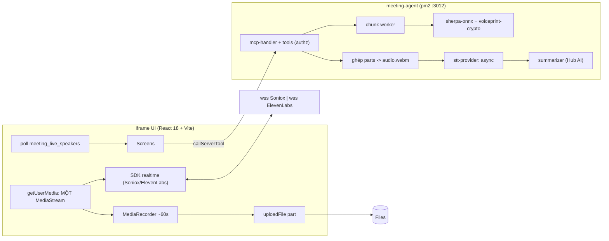

# System Architecture

Nguồn sự thật chi tiết: `plans/260917-1358-…/plan.md`. Tài liệu này tóm tắt kiến trúc
đã hiện thực ở Phase 1 và giữ chỗ cho **kết quả spike** phải điền khi chạy với Hub thật.

## Boot & runtime mode

App boot qua `serveApp` (`@privos_ai/app-server`) trong `src/server/index.ts`. Mode tự
phát hiện, không đặt bằng env:

| Mode | Resolved khi | Transport/trust |
|---|---|---|
| `managed` | có workload socket (`PRIVOS_WORKLOAD_SOCKET`) | serveApp, Hub-signed |
| `standalone-production` | có identity file (`npm run pair`) | serveApp, dispatch trust |
| `development` | không có cả hai và `NODE_ENV`≠production | dev Relay loop, unverified actor |

Boot chạy `assertProviderKeysAtBoot()` (fatal ở production nếu provider đang chọn thiếu
khoá hoặc thiếu `VOICEPRINT_ENC_KEY`) và self-check credential bot.

## Backend Hub access (installation bot)

Mọi ghi App DB/job/settings đi qua `POST /api/v1/mcp-apps.tool-call` với credential bot
(`src/server/hub/bot-tool-call.ts` → `callAppPlatformTool`). `roomId` **tuỳ chọn** —
collection `scope:'global'` (speaker_profiles, app_settings) gọi room-lessly (QĐ-05).
`resolveOwnMcpAppId()` cấp `mcpAppId` cho body. Iframe chỉ **đọc** App DB để hiển thị.

## Data flow (record → live naming → process → review)

## App DB collections

Nguồn sự thật: `src/shared/app-db-schema.ts` (7 collection). Global: `speaker_profiles`,
`app_settings`. Room: `meetings`, `meeting_speakers`, `action_items`, `bookmarks`,
`processing_jobs`. Field chỉ có `string|number|boolean|date|array|reference`.

## STT provider layer

`src/server/stt/stt-provider.ts` (interface) + `stt-provider-registry.ts` (chọn theo
`app_settings` → env) + bốn vỏ (soniox/elevenlabs × realtime/async). Phase 1 là vỏ; logic
thật ở P2 (realtime token mint) / P3 (async transcribe).

## Speaker identity + voiceprint (P4)

`src/server/speaker/` — mọi module xuất hàm thuần (không gắn vòng đời job), để P5 (live
naming) dùng lại nguyên xi:

- `voiceprint-crypto.ts`: AES-256-GCM + HMAC-SHA256 (`VOICEPRINT_ENC_KEY`, HKDF-derived
  MAC key) bọc mọi embedding trước khi ghi App DB — `openEmbedding` không bao giờ ném lỗi,
  HMAC sai → `null` + log `hmac_mismatch` (QĐ-06).
- `embedding-extractor.ts`: lazy singleton quanh `sherpa-onnx-node`'s
  `SpeakerEmbeddingExtractor`, nạp qua **dynamic import** (package không có `.d.ts` — xem
  `sherpa-onnx-node.d.ts`) và fail rõ ràng khi thiếu model/native addon; `dim` đọc runtime.
- `segment-picker.ts` → `resolve-speakers.ts`: chọn range sạch mỗi speaker, embed **từng
  range riêng** (không nối PCM trước) để tính `minPairwiseCosine` — cụm lưỡng đỉnh (hai
  giọng lẫn một turn) bị chặn enrol tự động dù embedding trung bình có vẻ khớp ai đó.
- `speaker-matcher.ts`: so **từng embedding** (max), không so centroid.
- `profile-store.ts`: CRUD `speaker_profiles` (global, room-less), `withProfileLock` +
  re-read trước khi ghi (chặn 2 job ghi đè `embeddings[]`), cap 20 embedding/profile.

Tool: `speaker_resolve` (owner, 4 mode, cổng đồng nhất nội cụm), `speaker_profile_list/_update/_delete`
(`createdByUserId` hoặc admin), `meeting_relabel_speaker` (back-propagate, P7 dùng lại).

## Spike results — CHƯA CHẠY (cần Hub + credential + khoá vendor thật)

Điền quan sát thực tế vào các mục dưới khi chạy `scripts/spikes/*` với môi trường thật.

1. **Mic** (spike-01): getUserMedia trong tab phòng dưới `_meta.ui.permissions`. → _TBD_
2. **uploadFile ceiling** (spike-02): base64 tối đa → độ dài timeslice. → _TBD_
3. **CSP/presign** (spike-03): `PRIVOS_FILES_ORIGIN`, fetch transcript.json + audio. → _TBD_
4. **Global collection room-less** (spike-04): getSchema trả scope:'global' không roomId. → _TBD_
5. **Hub AI** (spike-05): generate-async + attempt-status bằng bot credential. → _TBD_
6. **Bot getMe** (spike-06): nguồn botToken cho Send to Chat. → _TBD_
7. **IndexedDB** (spike-07): có dùng làm buffer best-effort không. → _TBD_
8. **Soniox realtime SDK** (spike-08): JSON token thô; `translation:two_way` có sống chung
   `enable_speaker_diarization` không; `speaker` trên token `is_final`; mã đóng thật; độ trễ;
   origin SDK chạm. → _TBD_
9. **Soniox async** (spike-09): JSON output thô + tên trường thật + thời gian quay vòng; giới
   hạn kích thước/thời lượng file. → _TBD_
10. **SDK wrapper + ghim version** (spike-10): gói nào (`@soniox/speech-to-text-web@1.4.0` vs
    `@soniox/client@2.3.0`) nhận custom stream + diarization. **Chốt trước khi viết P2.** → _TBD_
11. **Cả hai SDK boot dưới CSP** (spike-11): directive CSP thật, origin hai SDK, giới hạn đồng
    thời ElevenLabs realtime. → _TBD_

**A/B tiếng Việt** (`ab-vietnamese-quality.ts`): WER (vi+en) + gán người nói (50 lượt) + độ trễ
nhãn của `soniox-async` vs `elevenlabs-batch` trên ≥30 phút audio thật. **KHÔNG chặn P2+**; chỉ
chọn mặc định `STT_*_PROVIDER`. Kết quả + giá trị mặc định đã chọn → điền tại đây. → _TBD_
