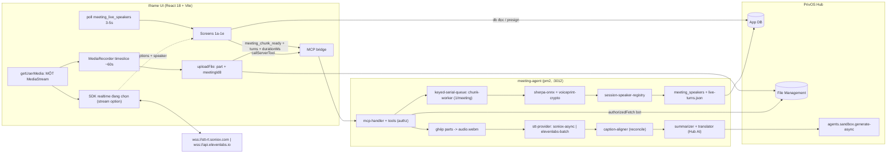

# Meeting Agent — PrivOS MCP App

## Overview

**Outcome.** MCP app PrivOS (`ai.privos.meeting-agent`) cho họp offline: bấm ghi trong phòng → mic trình duyệt thu toàn bộ cuộc họp + live caption song ngữ **kèm nhãn `Người nói N` ngay lập tức** → sau ~70-90s nhãn được thay bằng **tên thật** nhờ voiceprint → "End & summarize" → pass authoritative Soniox async → tóm tắt bằng Hub AI → lưu transcript + summary vào PrivOS File Management → xem lại (history, detail, player, search, export).

**Constraints.**
- **Hai nhà cung cấp STT hạng nhất** sau một interface `src/server/stt/stt-provider.ts` (QĐ-15): realtime `soniox-realtime` | `elevenlabs-realtime`, async `soniox-async` | `elevenlabs-batch`. Chọn theo **workspace** (`app_settings.sttRealtimeProvider` / `sttAsyncProvider`, Settings › Speech recognition, chỉ admin), mặc định từ env `STT_REALTIME_PROVIDER` / `STT_ASYNC_PROVIDER` (cả hai = `soniox`). Pass async là nguồn sự thật cho transcript lưu, bất kể nhà cung cấp nào.
- **Nhãn người nói được ưu tiên** (QĐ-18): chỉ Soniox realtime có `enable_speaker_diarization` → mặc định realtime là Soniox. Chọn `elevenlabs-realtime` = caption **không nhãn** lúc live, P5 **tắt cho cuộc họp đó** (degraded, UI nói rõ "Nhãn người nói sẽ có sau khi xử lý"); nhãn đến từ pass async + P4. Không nhà cung cấp nào có danh tính liên phiên — đó vẫn là việc của voiceprint (P4).
- **SDK của nhà cung cấp tự thu audio** từ một `MediaStream` do ta cấp — app **không** tự chuyển PCM, không tự dựng wire protocol, không tự lo backpressure (QĐ-01). Một `getUserMedia` duy nhất chia cho (a) SDK realtime đang chọn và (b) MediaRecorder.
- WS realtime: Soniox `wss://stt-rt.soniox.com/transcribe-websocket` (cap **300 phút/phiên**; vendor **không** nêu mã lỗi — mã đóng thật do spike P1-8 ghi nhận) · ElevenLabs `wss://api.elevenlabs.io` (single-use token `POST /v1/single-use-token/realtime_scribe`, tiêu thụ ngay lần connect đầu). Roll phiên ở ≈280 phút với Soniox; mọi close/error ở cả hai đều coi là kết thúc phiên. Mint khoá Soniox kèm `expires_in_seconds ≤ 3600`, `single_use: true`, `max_session_duration_seconds`.
- **Giới hạn theo tài khoản** (mọi phòng dùng chung một khoá): Soniox **10 WS đồng thời / 100 request/phút** → `LIVE_MAX_CONCURRENT_RECORDINGS` (mặc định 8, chừa chỗ roll-over) cưỡng chế ở `meeting_realtime_token`. Giới hạn đồng thời của **ElevenLabs realtime chưa xác minh** → áp **cùng** trần cho đơn giản (QĐ-19, câu hỏi mở). Vượt trần → từ chối kèm thông báo tiếng Việt, **ghi âm vẫn chạy**, chỉ mất caption.
- Token `is_final` được khoá (text không đổi); nhãn `speaker` realtime **có thể đổi tạm** trước khi ổn định.
- Iframe chạy trong sandbox opaque-origin (`srcdoc`, không `allow-same-origin`): **phải** khai `_meta.ui.permissions: ["microphone"]` thì `getUserMedia` mới chạy (`use-mcp-bridge-host.ts:196`, `McpAppTab.tsx:303`, `security-and-data-model.md:18`); `import.meta.url` là `about:srcdoc` nên **không fetch được asset anh em** (đây là lý do worklet bị loại). Storage không đảm bảo → **độ bền audio dựa trên Files, không dựa IndexedDB** (QĐ-13). `SONIOX_API_KEY`/`ELEVENLABS_API_KEY` chỉ nằm ở env backend (**cả hai optional; nhà cung cấp đang chọn bắt buộc phải có khoá**, kiểm lúc boot); iframe nhận **token ngắn hạn** của đúng nhà cung cấp đó qua tool có kiểm quyền + hạn mức.
- **Màn hình không tắt/sleep khi đang ghi** (yêu cầu 2026-09-17): Screen Wake Lock API (`navigator.wakeLock.request('screen')`) xin trong gesture "Bắt đầu ghi", xin lại sau `visibilitychange`, thả khi pause/End. Iframe opaque-origin cần `allow="screen-wake-lock"` mà Hub hiện chỉ cấp `camera`/`microphone` (`use-mcp-bridge-host.ts:193-198`) → khai `_meta.ui.permissions: ["microphone","screen-wake-lock"]` + ticket Hub; chưa có thì hiện dải cảnh báo hướng dẫn tắt sleep, ghi âm không phụ thuộc wake lock (P2).
- Node "hodao": 72 CPU, không GPU, Node v22.23, pm2, **không ffmpeg hệ thống**, python3 không torch → decode + embedding pure-Node (`@ffmpeg-installer/ffmpeg`, `sherpa-onnx-node`). **Không** có model diarization trên server (QĐ-16).
- Backend không có user session nhưng truy cập Hub đầy đủ bằng installation-bot credential (`POST /api/v1/mcp-apps.tool-call`, `roomId` **tuỳ chọn** — chỉ collection `scope:'room'` mới cần). Bắt buộc `PRIVOS_AGENT_BOT_USER_ID`/`PRIVOS_AGENT_BOT_CREDENTIAL` (Admin → Apps → Settings); bot là thành viên phòng để ghi Files. Không gọi LLM bên thứ ba: tóm tắt + dịch batch qua Hub AI (`agents.sandbox.generate-async`) bằng chính credential trên.
- UI bám design export (1a–1e) + PrivOS DS tokens, Montserrat + JetBrains Mono, KHÔNG emoji.

**Non-goals (v1).** Upload audio có sẵn; video meeting/bot join họp online; vector search trong App DB; RAG "Ask AI" thực thụ (v1 = keyword search trên summary, sai lệch có tài liệu); multi-tenant billing; tự động tách một `sessionSpeakerId` thành hai người (chỉ sửa tay).

**Acceptance criteria.**
- [ ] Ghi 60 phút liên tục; tab crash giữa chừng → mở lại có banner "Khôi phục?" và hoàn tất được từ các part đã upload, **mất tối đa ~60s audio cuối**.
- [ ] Mạng hỏng ≤ `LIVE_UPLOAD_RETRY_WINDOW_MIN` (mặc định 15 phút): ghi âm **không dừng**, part chờ trong hàng đợi và tự lên khi mạng về, UI báo "đang chờ mạng"; quá cửa sổ → part vẫn giữ trong RAM, người dùng bấm thử lại lúc End.
- [ ] Live caption < 1s sau khi nói; với realtime provider = Soniox có kèm nhãn `Người nói N` và người đã có voiceprint đổi sang **tên thật** ≤ 90s (retroactive cho cả dòng đã hiện); với `elevenlabs-realtime` caption không nhãn và UI nói rõ nhãn sẽ có sau khi xử lý.
- [ ] Bật song ngữ: dịch về cùng luồng token (Soniox native) **hoặc** điền sau 3-5s qua `meeting_translate` — tuỳ provider, cả hai đường đều chạy được trên dữ liệu thật.
- [ ] Sau "End & summarize" có đủ `audio.webm`, `transcript.json/.md/.srt`, `summary.md` trong `Meetings/<yyyy-mm-dd>-<slug>-<meetingId8>/`; người nói chưa biết → modal "Xác nhận người nói" (hoặc quick-assign trong họp) → cuộc họp kế tiếp tự nhận đúng (≥2 cuộc họp, ≥3 người).
- [ ] Phòng B không đọc/xử lý/xoá được dữ liệu phòng A; hai cuộc họp cùng phòng/ngày/tiêu đề **không** ghi đè nhau (negative test P8).
- [ ] History + detail + player + search + export SRT/DOCX chạy trên dữ liệu thật; `npm run verify:fast-pr` xanh; app chạy pm2 `meeting-agent` trên hodao.

## Kiến trúc tổng thể

**Data flow record → live naming → process → review**
1. `new-meeting` → iframe tạo `meetings` (`status:'recording'`, `roomId`, `folderId` = `Meetings/<date>-<slug>-<meetingId8>/`) → **một** `getUserMedia` → chốt `recorderEpochMs` ngay trước `mediaRecorder.start(60000)`; mỗi blob vào hàng đợi upload (`audio.part-NNNN-<meetingId8>.webm`, `keep_both`). **Cùng** `MediaStream` được truyền vào `.start({stream, …})` của SDK Soniox — SDK tự thu, tự gửi → token `{text, start_ms, end_ms, is_final, speaker, language, confidence, translation_status}` → caption + badge `Người nói N` (+ bản dịch nếu bật `translation: two_way`).
2. Sau mỗi part upload xong → `meeting_chunk_ready {roomId, meetingId, seq, durationMs, segments[]}` — gửi **mọi** turn bắt đầu trong cửa sổ part, kể cả turn chưa final (`final:false`); chunk kế tiếp gửi lại bản đã final (dedupe `speakerKey+startMs`). Chunk worker: decode part (+overlap) → xác thực span → cắt PCM theo turn → embedding → session registry (xác minh từng quan sát) → match `speaker_profiles` → ghi `meeting_speakers` + nối `live-turns.json`. Turn vượt quá audio đã decode được **hoãn** sang chunk sau, không bị bỏ.
3. Iframe poll `meeting_live_speakers` mỗi 3-5s → **sửa lùi** nhãn của các dòng caption đã hiện. Chưa khớp profile → nút "Ai đang nói?" gọi `speaker_resolve` ngay trong họp. Realtime provider không gán turn (ElevenLabs) → bước 2-3 **bị bỏ qua hoàn toàn**, UI hiện "Nhãn người nói sẽ có sau khi xử lý" (QĐ-18).
4. "End & summarize" → upload part cuối → `meeting_process {roomId, meetingId}` (backend đọc `partFileIds` từ `meetings`, **không** nhận fileId từ client). Job (bot credential): tải các part theo thứ tự → byte-concat → `audio.webm` → xoá part → **Soniox async** (upload → create transcription → poll/webhook → tokens) → segments → embedding + match (vector mã hoá AES-256-GCM) → reconcile speaker async ↔ live registry bằng max time-overlap → dịch batch (nếu bật) → tóm tắt Hub AI → ghi 4 file lên Files + ghi App DB.
6. Review: history (1d) / detail (1c) đọc App DB + `transcript.json`; player stream `audio.webm` qua presigned URL (`media-src` phải cho phép origin lưu trữ).

## Quyết định thiết kế

| # | Quyết định | Lý do | Alternative đã loại |
|---|---|---|---|
| QĐ-01 | Live caption qua **SDK chính thức của nhà cung cấp đang chọn** (Soniox: gói chốt ở spike P1-10, option camelCase + `stream`, `.stop()`; ElevenLabs: `@elevenlabs/client` `Scribe.connect({ microphone:false })` với single-use token) — SDK **tự thu** từ `MediaStream` ta cấp. Backend mint token của đúng nhà cung cấp đó | Không SDK nào nhận PCM thô: tự chuyển đổi/gửi frame là tái phạm RT-15. Một `MediaStream` cho cả SDK và MediaRecorder giữ hai nhánh cùng nguồn audio | Tự dựng wire protocol + AudioWorklet + PCM16 + `bufferedAmount` (đã loại — S2-01); **fallback duy nhất** nếu SDK không nhận custom stream: WebSocket thô ở main thread, nguồn audio `ScriptProcessorNode` (không worklet, không blob URL) |
| QĐ-03 | Pass hậu họp authoritative = **async provider đang chọn**: `soniox-async` (`stt-async-v5`, nhận webm/opus trực tiếp) hoặc `elevenlabs-batch` (`scribe_v2`, `diarize:true`, `timestamps_granularity:'word'`, `diarization_threshold` từ env, cần wav 16k đã decode). Cả hai trả về cùng `SttResult` | Cùng cho diarization đầy đủ ngữ cảnh (chính xác hơn realtime); workspace chọn theo chất lượng tiếng Việt và hợp đồng sẵn có | Chỉ một nhà cung cấp (đã loại — U1); tự dựng transcript từ caption realtime |
| QĐ-02 | `sherpa-onnx-node` (Apache-2.0) cho embedding | Pure Node, không Python/torch/GPU; Soniox **không có** enrollment/voiceprint (đã soát toàn bộ docs) → đây là cơ chế danh tính liên phiên duy nhất | Python sidecar SpeechBrain → giữ làm fallback |
| QĐ-04 · QĐ-08 · QĐ-10 · QĐ-11 · QĐ-14 | App DB = metadata + speaker map + action items, Files = transcript đầy đủ (QĐ-04) · Lists chỉ cho "Push to Smart List", Settings **không** có ô nhập API key STT (QĐ-08) · decode webm bằng `@ffmpeg-installer/ffmpeg`, chỉ phục vụ embedding (QĐ-10) · export DOCX sinh ở iframe bằng `docx` npm (QĐ-11) · `meeting_settings_set` là tool backend chỉ workspace admin (QĐ-14) | App DB không có kiểu object và `query.limit ≤ 1000`; field type Lists không có array, key là secret backend; node hodao không có ffmpeg hệ thống và Soniox async nhận webm native; kênh MCP cap 8 MB/60 s (`hub-file-upload.ts:5-10`); cấu hình ảnh hưởng cả workspace | Collection `segments`; Lists làm store chính; `ffmpeg-static` (GPL-3.0); tool backend render DOCX; iframe ghi thẳng `app_settings` |
| QĐ-05 | Backend đọc/ghi App DB bằng installation-bot credential qua `hub/bot-tool-call.ts`; `processing_jobs` là job state authoritative (unique `{meetingId:1}`); không có file job state cục bộ. `roomId` là tham số **tuỳ chọn** — collection `scope:'global'` đăng ký/đọc room-lessly | Xác minh: demo `app-db-demo-tool.ts` + `app-platform-tool-call.ts`; Hub chỉ bắt buộc `roomId` cho `scope:'room'` (`mcp-app-db-schema-registry.ts:19-23,44-48`, `mcp-apps.ts:2495` `roomId?: string`, `rest-tool-call.md:22`) | `data/jobs/*.json` + iframe mirror; truyền roomId cho global |
| QĐ-06 | Voiceprint ở App DB nhưng **mã hoá AES-256-GCM + HMAC-SHA256** (`VOICEPRINT_ENC_KEY`); match ở backend; iframe chỉ thấy ciphertext, tool không bao giờ trả vector | `db:*` cấp cho iframe cùng namespace → "vector không rời backend" chỉ cưỡng chế được bằng mật mã | Tin vào ranh giới tool; match ở iframe |
| QĐ-07 | Summarizer + translator = **Hub AI** `POST agents.sandbox.generate-async` + poll `agents.sandbox.attempt-status`, dùng chính bot credential | Không xuất transcript ra bên thứ ba, không thêm secret; giới hạn prompt < 50000 / systemContext < 200000 ký tự → chunk theo đó (`auth-and-rest-integration.md:59-74, 99-147`) | Anthropic SDK + `ANTHROPIC_API_KEY` |
| QĐ-12 | Dịch **live** có hai đường: (a) **native Soniox** `translation: { type:'two_way', language_a:'vi', language_b:'en' }` trên cùng socket — **ưu tiên** khi tương thích; (b) **`meeting_translate` qua Hub AI** gom lô 3-5 s — dùng khi realtime provider **không** có dịch native (ElevenLabs) **hoặc** khi spike P1-8 cho thấy `translation` xung đột với `enable_speaker_diarization`. Dịch **batch** luôn là Hub AI (QĐ-07) | Nhãn người nói ưu tiên hơn dịch native (QĐ-18); đường Hub AI là mạng an toàn chung cho mọi provider, không phải mã chết | Chỉ native (mất dịch khi dùng ElevenLabs); chỉ Hub AI (bỏ phí tính năng đã trả tiền của Soniox) |
| QĐ-13 | Độ bền audio = **part file trên Files** (`audio.part-NNNN.webm` mỗi ~60s), backend ghép lại; IndexedDB chỉ là buffer best-effort tuỳ chọn | Storage của opaque origin không đảm bảo; `uploadFile` là base64 qua bridge nên phải chia nhỏ (~4-6 MB) | IndexedDB làm nguồn bền + chunked upload REST |
| QĐ-15 | **Hai nhà cung cấp hạng nhất** sau `src/server/stt/stt-provider.ts`: `soniox-realtime` / `elevenlabs-realtime` / `soniox-async` / `elevenlabs-batch`, chọn theo workspace. **Không** có khái niệm "fallback chưa cài" — cả bốn đều được cài và test. Script A/B (`scripts/spikes/ab-vietnamese-quality.ts`) **chỉ để chọn mặc định**, không chặn phase nào | Chất lượng tiếng Việt của Soniox chưa có nguồn độc lập; workspace nào đã có hợp đồng ElevenLabs thì dùng luôn. Đổi nhà cung cấp = đổi một ô Settings, không phải viết code | Một nhà cung cấp + cổng A/B chặn P2-P8 (đã loại — U1); cài sẵn provider thứ hai nhưng không test (mã chết) |
| QĐ-16 | Live speaker naming dùng **turn do realtime provider gán** + embedding riêng của ta; **KHÔNG** chạy model diarization trên server (bỏ `OfflineSpeakerDiarization`/pyannote). Provider không gán turn (ElevenLabs realtime) → P5 **tắt** cho cuộc họp đó | Soniox đã cho phân đoạn người nói ở realtime → server chỉ cần embedding + cosine; dựng diarization riêng chỉ để cứu một provider là quá đắt | Self-host pyannote segmentation theo chunk 60s (phương án B của synthesis) |
| QĐ-17 | Đồng hồ họp = **đồng hồ của recorder**. `wsSessionOffsetMs` lấy tại callback "đã bắt đầu stream" của SDK (không phải lúc mint key, không phải `performance.now()` lúc mở WS). **Resync mỗi part**: khi part đóng, so `elapsed` của recorder với `offset + end_ms` của token final cuối → lưu `clockSkewMs`. Mọi phép gióng (`caption-aligner.ts`, cắt PCM ở P5) dùng **max-overlap với dung sai ±1.5 s** và áp `clockSkewMs` | SDK đệm audio trước khi key về → `start_ms = 0` ứng với lúc **bắt đầu thu**, không phải lúc mở socket; không resync thì sai số tích luỹ và cắt nhầm giọng | Tin `AudioContext.currentTime`; tin timestamp WS trực tiếp; đếm sample tự gửi (không còn khả thi khi SDK tự thu) |
| QĐ-18 | **Nhãn người nói > dịch native**: mặc định realtime = Soniox (provider duy nhất có nhãn live). Xung đột `translation` ↔ `enable_speaker_diarization` → giữ diarization, đẩy dịch sang `meeting_translate`. Chọn `elevenlabs-realtime` = chấp nhận P5 tắt (degraded có tài liệu) | Nhãn người nói là khác biệt chính của sản phẩm; bản dịch trễ 3-5 s vẫn dùng được, nhãn sai thì không | Ưu tiên dịch native; tắt diarization để giữ dịch |
| QĐ-19 | Trần `LIVE_MAX_CONCURRENT_RECORDINGS` áp **chung cho cả hai provider** dù chỉ số của Soniox là số đã xác minh | Một trần, một đường code, một thông báo lỗi; nới sau khi đo được giới hạn thật của ElevenLabs | Trần riêng theo provider (thêm nhánh cho một con số chưa biết) |

## Data model

### App DB (`mcpapp.db.*`) — định nghĩa tại `src/shared/app-db-schema.ts`, đăng ký bởi **backend** trong `meeting_bootstrap`

Field chỉ có `string | number | boolean | date | array | reference` — giá trị có cấu trúc lưu JSON string. `registerCollection` KHÔNG idempotent phía Hub → lỗi `/already registered/i` coi như thành công (demo `app-db-demo-tool.ts`).

| Collection | Scope | Fields | Indexes |
|---|---|---|---|
| `speaker_profiles` | global | `displayName`, `displayNameNormalized` (req), `privosUserId`, `privosUsername`, `colorKey`, `createdByUserId` (req), `createdInRoomId`, `embeddings` (array string — JSON `{ct, iv, tag, hmac, meetingId, durationSec, createdAt}`), `centroid` (string, ciphertext), `dim`, `sampleCount` (number), `lastSeenAt` (date) | `{privosUserId:1}`, `{displayNameNormalized:1}`, `{createdByUserId:1}` |
| `app_settings` | global | `key` (req, unique), `valueJson` (req) — `sttRealtimeProvider`, `sttAsyncProvider`, `speakerMatchThreshold`, `speakerSessionMatchThreshold`, `autoDeleteAudioDays` (90), `knownRooms`, `summaryLength`, … | `{key:1}` unique |
| `meetings` | room | `roomId` (req), `title`, `slug`, `startedAt`/`endedAt` (date), `durationSec`, `language`, `translationEnabled` (bool), `translationLang`, `ownerUserId` (req), `status` (recording/uploading/processing/summarized/failed/**interrupted**), `folderId`, `partCount` (number), `lastPartAt` (date — phát hiện meeting bị bỏ rơi), `keepAudio` (bool), `sttSessionMeta` (string JSON — `{recorderEpochMs, sessions:[{index, wsSessionOffsetMs, startedAt, clockSkewMs}]}`), `liveTurnsFileId`, `audioFileId`, `transcriptJsonFileId`, `transcriptMdFileId`, `srtFileId`, `summaryFileId`, `summaryText`, `keyTopics` (array), `speakerCount`, `audioDeletedAt`/`sentToChatAt` (date), `summaryError` | `{startedAt:-1}`, `{status:1}` |
| `meeting_speakers` | room | **Một hàng cho mỗi người**: `meeting` (ref→meetings, cascade), `speakerId` (id của pass async; `null` cho tới khi reconcile), `sessionSpeakerId` (live), `sonioxLabels` (array string — nhãn `speaker` realtime đã gộp, dạng `s{sessionIndex}:{label}[@n]`), `profileId`, `displayName`, `nameSource` (`user`/`async`/`live`), `privosUserId`, `confidence` (pass async), `liveConfidence`, `liveSpeechSec`, `liveUpdatedAt` (date), `snapshotHash` (chặn ghi thừa), `resolved` (bool), `totalSpeakSec`, `colorKey`, `sampleStartSec`/`sampleEndSec`, `pendingEmbedding` (ciphertext + hmac; **giữ tới khi job async xong** rồi mới xoá) | `{meeting:1}` |
| `action_items` · `bookmarks` | room | `meeting` (ref, cascade) + `task` (req)/`owner`/`due`/`atSec`/`done`/`listItemId` · `atSec` (req)/`quote`/`createdBy` | `{meeting:1}`, `{done:1}` · `{meeting:1}` |
| `processing_jobs` | room | `meetingId` (req, unique), `roomId` (req), `jobId` (req), `language`, `title`, `keepAudio` (bool), `partFileIds` (array), `audioFileId`, `providerFileId`/`providerTranscriptionId` (ghi **ngay khi tạo**, trước lần poll đầu — để dọn rác và nối lại thay vì upload lại), `status` (queued/processing/completed/failed), `step`, `progress`, `error`, `resultJson`, `startedAt`/`heartbeatAt`/`finishedAt` (date) | `{meetingId:1}` unique, `{jobId:1}`, `{status:1}` |

### Quyền ghi theo trường (nguồn sự thật duy nhất)

| Trường | Ghi bởi | Khi nào |
|---|---|---|
| `meetings`: `roomId, title, slug, startedAt, language, translation*, ownerUserId, folderId, partCount, keepAudio, sttSessionMeta, status:'recording'\|'uploading', endedAt, durationSec` | iframe (user ctx) | Lúc ghi âm / kết thúc ghi |
| `meetings`: `status:'processing'\|'summarized'\|'failed'`, mọi `*FileId`, `summaryText`, `keyTopics`, `speakerCount`, `summaryError`, `audioDeletedAt`, `sentToChatAt` | backend (bot) | Trong job / retention / send-to-chat |
| `bookmarks` (toàn bộ) · `action_items.done`, `.listItemId` | iframe | Lúc ghi âm / review |
| `action_items` (còn lại) · `meeting_speakers` (gồm trường live) · `processing_jobs` · `speaker_profiles` · `app_settings` · `meetings.liveTurnsFileId` | backend (bot) | Job + chunk worker + tool |

### PrivOS Files + Lists

Upload của Hub Files là **upsert tại chỗ theo (channel, path)** (`file-management/stable-file-id-and-replace-semantics.md:19-40`) → hai cuộc họp cùng ngày cùng tiêu đề trong một phòng sẽ **ghi đè lên nhau**. Vì vậy thư mục là `Meetings/<yyyy-mm-dd>-<slug>-<meetingId8>/`, part là `audio.part-NNNN-<meetingId8>.webm` với `duplicateAction:'keep_both'` (**không bao giờ** `replace` cho part), và `concatParts` kiểm dấu `meetingId8` của từng part, chỉ xoá đúng `partFileIds` đã ghi trong `processing_jobs`, không quét thư mục. Thư mục chứa `audio.part-NNNN-<meetingId8>.webm` (tạm) → `audio.webm` (opus ~30-40MB/h, xoá theo chính sách lưu trữ) · `live-turns.json` (span nhãn live do backend nối thêm sau mỗi part, ≤ vài trăm KB — reconcile đọc từ đây, **không** để trong App DB) · `transcript.json` (`{meeting, tokens[], segments[{text, translation?, lang}], speakers[]}` — nguồn sự thật) · `transcript.md` · `transcript.srt` · `summary.md`. Lists chỉ dùng cho "Push to Smart List": find-or-create list `Meeting action items` (pattern gia-pha `list-provisioner.ts`), fields Task/Owner/Due/Meeting/Status.

## MCP tools

Bộ tool cuối cùng (18) — mọi tool đều khai trong `privos-app.json` + `src/server/manifest.ts`, và **fail closed** khi thiếu `context.actor` hoặc `identityState !== 'verified'` (ngoại lệ dev: `NODE_ENV!=='production'` && `ALLOW_UNVERIFIED_ACTOR=1`).

| Tool | Input | Output / ghi chú | Authz |
|---|---|---|---|
| `meeting_agent` | `{ roomId? }` | UI resource `ui://meeting-agent/app.html`; `_meta.ui.permissions:["microphone"]` | mọi thành viên phòng |
| `meeting_agent_bot_credential_check` / `meeting_bootstrap` | `{}` · `{ roomId }` | `{ status, botId?, username? }` · đăng ký schema (global room-lessly), cập nhật `knownRooms`, đảm bảo bot là thành viên phòng, sweep job treo + meeting bỏ rơi + audio hết hạn | thành viên phòng |
| `meeting_realtime_token` | `{ roomId, meetingId }` | `{ provider, token, wsUrl?, expiresAt, model?, capabilities:{ speakerLabels, translation } }` — mint token của **realtime provider đang chọn** (Soniox temporary key `usage_type:'transcribe_websocket'`, `single_use`, `max_session_duration_seconds`, `client_reference_id=meetingId`; hoặc ElevenLabs single-use token `realtime_scribe`) | owner + `status:'recording'` + budget 30/giờ/(user,meeting) + trần `LIVE_MAX_CONCURRENT_RECORDINGS` (đếm meeting `recording` còn heartbeat trên mọi `knownRooms`); log `{userId, roomId, meetingId, provider}` |
| `meeting_chunk_ready` | `{ roomId, meetingId, seq, durationMs, segments[{speaker, startMs, endMs, final}] }` | `{ accepted: true }` — idempotent theo `seq`; xếp vào hàng đợi tuần tự theo `meetingId`. Backend **xác thực span** (nằm trong biên part, không chồng lấn cùng speaker, có năng lượng RMS, cap số turn) trước khi dùng | owner + `status:'recording'\|'uploading'` |
| `meeting_live_speakers` | `{ roomId, meetingId }` | `{ sessionSpeakers[{sessionSpeakerId, sonioxLabels[], displayName?, profileId?, liveConfidence?, colorKey, resolved}], updatedAt }` — **không** vector | thành viên phòng của meeting |
| `meeting_translate` | `{ roomId, meetingId, target, segments[{id,text,lang?}] }` | `{ translations[{id,text}] }` — Hub AI sync, gom lô 3-5 s, rate-limit theo meeting. Chỉ dùng khi realtime provider **không** dịch native (QĐ-12); bỏ qua segment đã ở ngôn ngữ đích | owner/thành viên phòng của meeting |
| `meeting_process` / `meeting_status` / `meeting_summarize` | `{ roomId, meetingId }` | `{ jobId, status }` (fileIds đọc từ `meetings`, kiểm `channel_id === roomId` từng file) · `{ status, step, progress, heartbeatAt, stale, error?, result? }` — `result.speakers[]` có `displayName/profileId/confidence/resolved/sampleRange`, **không** vector, **không** id phía Soniox · chạy lại riêng bước tóm tắt từ `transcript.json` | `_process`/`_summarize`: owner + `meetings.roomId === args.roomId === actor.roomId`; `_status`: thành viên phòng của meeting |
| `speaker_resolve` | `{ roomId, meetingId, assignments[{speakerId, mode:'user'\|'name'\|'merge'\|'skip', privosUserId?, displayName?, profileId?}] }` | `{ resolved[] }` — backend giải mã `pendingEmbedding`, **kiểm đồng nhất nội cụm** rồi mới enrol (cụm lưỡng đỉnh → chỉ đặt tên, không enrol), đặt `nameSource:'user'`. **Dùng chung cho quick-assign giữa họp** (`speakerId` = `sessionSpeakerId`) | owner |
| `speaker_profile_list` / `_update` / `_delete` | `{}` · `{ profileId, displayName?, privosUserId?, action?:'reenrol' }` · `{ profileId }` | `{ profiles[{id, displayName, privosUserId, sampleCount, lastSeenAt, meetingCount}] }` (không vector, hiển thị toàn workspace — đánh đổi đã ghi nhận) · `{ profile }` · `{ deleted:true }` (xoá embeddings, `pendingEmbedding` và liên kết trong mọi `knownRooms`) | `_list`: user đã verify; `_update`/`_delete`: `createdByUserId` hoặc workspace admin |
| `meeting_relabel_speaker` / `meeting_send_to_chat` | `{ roomId, meetingId, speakerId, profileId\|displayName }` · `{ roomId, meetingId }` | `{ updated }` + back-propagate voiceprint (đặt `nameSource:'user'`) · `{ messageId }` — nội dung dựng **ở server** từ summary đã lưu | owner |
| `meeting_settings_set` / `meeting_stt_status` | `{ key, value }` · `{}` | `{ settings }` · admin thấy `{ ok, realtime:{provider, ok, models, activeSessions}, async:{provider, ok, models, usage?} }` **cho cả hai nhà cung cấp** (kể cả cái đang không dùng, để so sánh trước khi đổi), người khác chỉ `{ ok }` | workspace admin (QĐ-14) |

Iframe gọi thẳng `usePrivosApp()` cho Files (upload/presign), Lists, `channels.members` và **đọc** App DB; mọi ghi voiceprint/job/settings đi qua tool.

### Manifest permissions (`privos-app.json`)

| Scope | requirement | context | executionContext | reason | degradedBehavior |
|---|---|---|---|---|---|
| `basic:information` · `files:read`/`files:write` | required | room | both · user | Xác định user + phòng; upload part + audio, ghi/đọc transcript, stream audio | — |
| `db:schema:read`/`_write` · `db:read`/`db:write` | required | room | user | Kiểm tra + đăng ký collection (qua bot credential); meetings, processing_jobs, speaker_profiles, action items, bookmarks | — |
| `sandbox:generate` | required | room | user | Tóm tắt + dịch batch bằng Hub AI | — |
| `rooms:read` · `lists:read`/`lists:write` · `bot:room:join` · `bot:identity:read` | optional | room | user | Picker thành viên phòng khi gán người nói; Push to Smart List; `meeting_bootstrap` thêm bot vào phòng để ghi Files | Gõ tên tự do; ẩn nút Push; nhờ admin thêm bot thủ công (xử lý dừng tới khi bot vào phòng) |

Tool `meeting_agent` khai **một** object `_meta.ui` chứa cả `resourceUri`, `permissions: ["microphone"]`, `csp`, `hideAiChat` (`developer-guide.md:47-48`) — `csp` đặt ở key `ui` anh em sẽ bị **bỏ qua im lặng**, manifest vẫn lint sạch:
`connect-src` = `wss://stt-rt.soniox.com` + `wss://api.elevenlabs.io` + `PRIVOS_FILES_ORIGIN` (cả hai origin WS đều khai sẵn — đổi provider là đổi một ô Settings, không được đòi republish manifest); `media-src` = `PRIVOS_FILES_ORIGIN`. **Không** khai `https://api.soniox.com`/`https://api.elevenlabs.io` trừ khi spike cho thấy SDK tự gọi origin HTTPS đó (đánh dấu cho spike P1-10/P1-11) — backend mới là bên mint token. Không cần `script-src` vì đã bỏ AudioWorklet (S2-01).

`db:*` giữ `executionContext:"user"` giống demo — `mcp-apps.tool-call` xác thực caller như một user, caller là bot thì "user" chính là tài khoản bot. `dataPolicy` nói rõ: audio của người tham dự stream sang **Soniox** (realtime, zero-retention mặc định) và upload sang Soniox async (tự xoá sau 30 ngày); transcript xử lý bởi Hub AI trong workspace. CSP là kiểm soát tải tài nguyên của iframe, **không** phải kiểm soát egress của backend.

## Env vars

| Key | Required | Secret | Default | Mục đích |
|---|---|---|---|---|
| `PORT` | no | no | `3012` | Cổng nghe (đã xác minh trống trên hodao) |
| `SONIOX_API_KEY` / `ELEVENLABS_API_KEY` | optional* | yes | — | Khoá của từng nhà cung cấp. *Ít nhất một cái phải có, và **nhà cung cấp đang chọn bắt buộc phải có khoá** — kiểm lúc boot, thiếu thì fail-fast kèm tên setting đang trỏ tới |
| `STT_REALTIME_PROVIDER` / `STT_ASYNC_PROVIDER` | no | no | `soniox` / `soniox` | Mặc định cấp env; `app_settings.sttRealtimeProvider`/`sttAsyncProvider` (admin) ghi đè |
| `SONIOX_RT_MODEL` / `SONIOX_ASYNC_MODEL` | no | no | `stt-rt-v5` / `stt-async-v5` | Model realtime / async của Soniox |
| `ELEVENLABS_REALTIME_MODEL` / `ELEVENLABS_BATCH_MODEL` / `ELEVENLABS_DIARIZATION_THRESHOLD` | no | no | `scribe_v2_realtime` / `scribe_v2` / `0.22` | Model realtime, model batch, ngưỡng `diarization_threshold` của `elevenlabs-batch` |
| `SONIOX_TEMP_KEY_TTL_SEC` / `LIVE_MAX_CONCURRENT_RECORDINGS` / `LIVE_UPLOAD_RETRY_WINDOW_MIN` | no | no | `900` / `8` / `15` | `expires_in_seconds` khoá tạm Soniox (≤ 3600); trần phiên realtime đồng thời toàn workspace, áp chung cả hai provider (QĐ-19); số phút giữ part chưa upload trong RAM để retry |
| `SPEAKER_MODEL_PATH` / `SPEAKER_MATCH_THRESHOLD` / `SPEAKER_MIN_SEGMENT_SEC` / `SPEAKER_ENROL_TARGET_SEC` | yes / no / no / no | no | `models/3dspeaker_…_advanced.onnx` / `0.5` / `2` / `25` | ONNX embedding (tải lúc deploy); ngưỡng cosine liên phiên (ghi đè bằng `app_settings`); segment tối thiểu; tổng thời lượng enrol |
| `SPEAKER_SESSION_MATCH_THRESHOLD` / `_MERGE_THRESHOLD` / `LIVE_MIN_SPEECH_SEC` / `LIVE_CHUNK_OVERLAP_SEC` | no | no | `0.40` / `0.60` / `8` / `8` | Ngưỡng trong-phiên P5 (khớp / gộp session speaker), tối thiểu giây nói trước khi thử match profile, overlap ring buffer giữa hai chunk |
| `VOICEPRINT_ENC_KEY` | **yes** | yes | — | AES-256-GCM 32 byte base64; **mất khoá = mất toàn bộ voiceprint** → bắt buộc backup (P8) |
| `SUMMARY_MODEL` / `PRIVOS_FILES_ORIGIN` / `MEETING_DATA_DIR` / `MEETING_JOB_CONCURRENCY` / `MEETING_JOB_TIMEOUT_MS` | no / **yes** / no / no / no | no | — / — / `./data` / `1` / `3600000` | `model` Hub AI; origin presigned download (khai `connect-src`/`media-src`); thư mục tạm khi decode; job song song; timeout job |
| `PRIVOS_AGENT_BOT_USER_ID` / `PRIVOS_AGENT_BOT_CREDENTIAL` · `MCP_APP_ID` / `ALLOW_UNVERIFIED_ACTOR` | **yes** · dev only | (credential: yes) | — | Credential installation bot (Admin → Apps → Settings); `resolveOwnMcpAppId()` cho body `mcp-apps.tool-call` + cờ dev cho actor chưa verify (production luôn fail closed) |

## Phases

| # | Phase | Effort | Dependencies |
|---|---|---|---|
| 1 | [Scaffold app foundation](./phase-01-scaffold-app-foundation.md) | 3d | — |
| 2 | [Live recording and realtime captions](./phase-02-live-recording-and-realtime-captions.md) | 4d | 1 |
| 3 | [Post-meeting diarization pipeline](./phase-03-post-meeting-diarization-pipeline.md) | 4d | 2 |
| 4 | [Speaker identity and voice fingerprint](./phase-04-speaker-identity-and-voice-fingerprint.md) | 3d | 3 |
| 5 | [Live speaker naming from chunks](./phase-05-live-speaker-naming-from-chunks.md) | 3.5d | 3, 4 |
| 6 | [AI summary, translation and save to Files](./phase-06-ai-summary-and-save-to-privos-files.md) | 3d | 3 |
| 7 | [History and meeting detail review](./phase-07-history-and-meeting-detail-review.md) | 3d | 3, 4, 5, 6 |
| 8 | [Settings, hardening, tests and hodao deploy](./phase-08-settings-hardening-tests-and-hodao-deploy.md) | 4.5d | 1–7 |

Chạy tuần tự 1→8. P1 chứa toàn bộ spike nền tảng; **script A/B tiếng Việt chỉ để chọn mặc định, KHÔNG chặn P2+** (U1). Spike nền tảng thất bại thì dừng và ghi nhận trước khi xây tiếp.

## Rủi ro chính

| Rủi ro | Mức | Tín hiệu | Giảm thiểu |
|---|---|---|---|
| **Chất lượng tiếng Việt của Soniox chưa được bên thứ ba kiểm chứng** (mọi số WER đều tự công bố) | Trung bình | A/B ở P1 cho WER VN lệch rõ so với `scribe_v2` | **Không còn là rủi ro chặn**: đổi sang `elevenlabs-*` là đổi một ô Settings (QĐ-15). A/B chạy trên audio thật để chọn mặc định và ghi số đo vào docs |
| Spike P1 thất bại (mic, uploadFile ceiling, CSP origin WS, global collection room-less, Hub AI) | Cao | Spike báo lỗi | P1 là cổng: ghi nhận lỗi quan sát được thành câu hỏi mở, **không** dựng sẵn đường thay thế |
| Nhãn `speaker` realtime đổi tạm/gộp sai → caption nhảy nhãn, centroid nhiễm bẩn | Cao | Nhãn đổi liên tục; cụm embedding lưỡng đỉnh | UI chỉ hiện `Người nói N` khi live; **mọi quan sát đều kiểm lại với centroid đang gắn**, dưới ngưỡng → mở instance nhãn mới `label@n` thay vì trộn; gắn dính chỉ sau ≥2 lượt và ≥ `LIVE_MIN_SPEECH_SEC`; enrol chỉ qua `speaker_resolve` và chỉ với cụm đạt kiểm tra đồng nhất nội cụm; **pass async là nguồn sự thật** |
| Mất `VOICEPRINT_ENC_KEY`; thiếu/hỏng bot credential hoặc bot chưa vào phòng; **hai khoá STT phải xoay vòng và theo dõi hạn mức riêng** | Cao | Giải mã thất bại hàng loạt; credential check `invalid`; tool-call 403; 401/429 từ một trong hai nhà cung cấp | `.env` 0600 + backup bắt buộc, HMAC sai → bỏ qua + log; self-check lúc boot + banner UI; `meeting_stt_status` hiện trạng thái **cả hai** khoá để admin thấy cái hết hạn trước khi người dùng gặp lỗi |
| Ngưỡng cosine / model sherpa sai (EER chưa kiểm chứng); đồng hồ họp lệch → cắt nhầm đoạn audio khi embedding | Cao | Sửa nhãn liên tục; `clockSkewMs` tăng dần | Ngưỡng + model là env/settings, hiện confidence, `calibrate-speaker-threshold.ts` trước khi bật auto-label; offset lấy từ callback "đã stream" + resync mỗi part, gióng ±1.5 s, lệch quá dung sai → `approxClock` và **không** embedding |
| **Vendor nhỏ (~15 người)** → ngừng dịch vụ/đổi giá | Thấp | Thông báo vendor; status page sự cố kéo dài | Cả hai provider đều đã cài và test → chuyển bằng Settings trong vài phút, không cần release |
| Cap 300 phút/phiên WS | Trung bình | Socket đóng gần mốc (mã đóng ghi từ spike P1-8, **không** giả định 413) | Roll chủ động ở ~280 phút với temp key mới + `wsSessionOffsetMs` mới; mọi close/error đều coi là kết thúc phiên |
| **Trần 10 WS đồng thời / tài khoản** → người thứ 11 mất caption | Cao | `meeting_realtime_token` từ chối; user báo "không có phụ đề" | `LIVE_MAX_CONCURRENT_RECORDINGS=8` cưỡng chế ở backend kèm thông báo rõ; **ghi âm vẫn chạy**, nhãn người nói đến từ pass async sau họp; nâng trần qua console Soniox nếu cần |
| **Ghi đè file giữa hai cuộc họp cùng phòng/ngày/tiêu đề** (upload Files là upsert theo path) | Cao | Audio cuộc họp này biến mất, part của cuộc kia bị xoá | `meetingId8` trong tên thư mục **và** tên part; `keep_both` cho part; `concatParts` kiểm dấu và chỉ xoá `partFileIds` đã ghi; negative test ở P8 |
| Restart giữa job → `processing_jobs` kẹt `processing`; meeting bị bỏ rơi kẹt `recording`; part rơi rớt | Trung bình | `heartbeatAt` cũ / `stale=true`; `lastPartAt` cũ > 10 phút; `partCount` ≠ số part tải được | Boot sweep + sweep trong `meeting_bootstrap`: job quá hạn → `failed(interrupted)`, meeting quá hạn → `interrupted` (giữ part, chủ sở hữu thấy "Khôi phục"/"Xử lý"); ghép theo chỉ số, thấy khoảng trống → `failed`; part chỉ xoá sau khi ghép xong |
| Chi phí STT + Hub AI theo **từng** nhà cung cấp; App DB quota / `limit 1000`; rác dữ liệu ở vendor | Trung bình | Usage tăng nhanh ở một provider; history thiếu record; file còn lại sau job lỗi | `meeting_stt_status` hiện usage **cả hai** provider; dịch live native không tốn thêm, đường Hub AI có rate-limit (QĐ-12); transcript không vào DB (QĐ-04) + phân trang; `providerFileId`/`providerTranscriptionId` lưu ngay + boot sweep dọn rác |
| Publish manifest fail vì scope lạ; `csp` khai sai chỗ bị bỏ qua im lặng; đổi provider mà CSP thiếu origin WS | Trung bình | `PROPOSAL_PERMISSION_UNKNOWN`; `Refused to connect` dù manifest lint sạch | `manifest:lint` + `preflight` trước khi pair; **khai sẵn cả hai origin WS** để đổi provider không cần republish; spike P1-11 xác nhận **cả hai** SDK boot được trong tab phòng thật |

## Câu hỏi chưa giải quyết

1. **A/B tiếng Việt — chọn mặc định, KHÔNG chặn phase nào.** Chủ dự án cung cấp ≥30 phút audio họp nội bộ VN+EN (có sự đồng ý) + transcript tham chiếu đội tự sửa từ bản máy. Đo WER (vi+en), độ chính xác gán người nói trên 50 lượt, độ trễ nhãn đầu tiên. Kết quả chỉ quyết định giá trị mặc định của `STT_*_PROVIDER`; chạy được lúc nào thì chạy, P2+ không chờ. Dùng chính `ELEVENLABS_API_KEY` (không còn `AB_ELEVENLABS_API_KEY`).
2. **Soniox async chưa xác nhận bằng lời gọi thật**: tên trường chính xác trong token output (`speaker`/`start_ms`/`end_ms`/`language`), **giới hạn kích thước/thời lượng file**, và **thời gian quay vòng** cho file 2-3h — docs không nêu. P1 spike phải lấy JSON thật trước khi viết parser.
3. **Token đã `is_final` có bị sửa lại trường `speaker` không** — docs không nói. Giả định "đã khoá" (theo cách hành văn của text) nhưng phải kiểm nghiệm thực tế ở P1; nếu bị sửa thì P2 cần đường relabel lùi cho cả nhãn live.
4. **Bề mặt API của SDK quyết định P2, phải chốt TRƯỚC khi viết P2.** `@soniox/speech-to-text-web@1.4.0` (`new SonioxClient({apiKey})` → `.start({model, languageHints, enableSpeakerDiarization, …, stream, onPartialResult, onError})` → `.stop()`) và `@soniox/client@2.3.0` (`client.realtime.*`) là **hai thế hệ API khác nhau** — đổi gói đổi mọi call site. Spike P1-10 dựng hẳn wrapper rồi mới ghim version. Chưa rõ SDK có tự gọi `https://api.soniox.com` hay không (ảnh hưởng CSP).
5. **Ngưỡng in-session** `SPEAKER_SESSION_MATCH_THRESHOLD` (0.40) và `SPEAKER_SESSION_MERGE_THRESHOLD` (0.60) là điểm xuất phát, chưa calibrate; cùng với `SPEAKER_MATCH_THRESHOLD` (0.5) phải chạy `calibrate-speaker-threshold.ts` trên ≥3 người × ≥2 buổi. **EER/kích thước model sherpa-onnx chưa công bố** — benchmark WeSpeaker CAM++ vs 3D-Speaker CAM++ zh_en vs TitaNet trước khi chốt.
6. **Data residency EU/US của Soniox** chưa xác nhận; **rate limit async** không có tài liệu riêng. Giới hạn realtime (100 req/phút, 10 WS đồng thời) là **theo tài khoản** — cần xác nhận với Soniox liệu có nâng được, và liệu 100 req/phút có tính cả lời gọi mint temporary key hay không (ảnh hưởng trần đồng thời thực tế).
7. **`translation: two_way` có sống chung với `enable_speaker_diarization` không** (QĐ-12/QĐ-18) — không có tài liệu. Spike P1-8 ghi lại: `speaker` còn được điền không, token gốc còn timestamp không, chi phí ra sao. Xung đột → giữ diarization, dịch live đi đường `meeting_translate` (đã có sẵn, không phải viết thêm).
8. **Giới hạn đồng thời của ElevenLabs realtime** (QĐ-19) — chưa xác minh; hiện áp chung trần `LIVE_MAX_CONCURRENT_RECORDINGS=8`. Đo ở P1 hoặc hỏi vendor trước khi mở rộng số phòng ghi song song.
9. **VAD/RMS nào dùng để xác thực span client gửi lên** (S2-05c) — ngưỡng RMS đơn giản hay `sherpa_onnx.Vad` (Silero, đã có sẵn trong `sherpa-onnx-node`). Chọn theo số đo CPU ở P5, mặc định bắt đầu bằng RMS.
10. **Ba câu hỏi nền tảng do P1 spike trả lời** — nguồn `botToken` cho `mcpapp.bot.sendMessage` (thất bại → "Send to Chat room" ship disabled); ACL cho lời gọi bot **không kèm `roomId`** (schema registry cho phép global room-lessly, cách Hub phân giải grant chưa quan sát được); `agents.sandbox.generate-async` bằng bot credential. Lỗi nào cũng ghi nguyên văn, không dựng sẵn đường thay thế.
12. **Hub có thêm `screen-wake-lock` vào `allow` của iframe MCP app không** — cần sửa `buildSandboxAttrs`/`embedAllowAttribute` phía Hub (ticket); tới lúc đó Wake Lock trong app chỉ là best-effort kèm `keep-awake-notice`. Cũng cần xác nhận hành vi khi màn hình tắt trên iOS/Android (mic có bị OS ngắt không).
11. **Ngưỡng `uploadFile` thực tế qua bridge** — P1 đo kích thước base64 tối đa để chốt độ dài timeslice (ảnh hưởng cả độ trễ live naming).

## Tài liệu tham khảo

- Soniox: [WebSocket API](https://soniox.com/docs/stt/api-reference/websocket-api) · [realtime transcription](https://soniox.com/docs/stt/rt/real-time-transcription) · [limits & quotas](https://soniox.com/docs/stt/rt/limits-and-quotas) · [async transcription](https://soniox.com/docs/stt/async/async-transcription) · [create transcription](https://soniox.com/docs/api-reference/stt/transcriptions/create_transcription) · [temporary API key](https://soniox.com/docs/api-reference/auth/create_temporary_api_key) · [speaker diarization](https://soniox.com/docs/stt/concepts/speaker-diarization) · [language identification](https://soniox.com/docs/stt/concepts/language-identification) · [language hints](https://soniox.com/docs/stt/concepts/language-hints) · [models](https://soniox.com/docs/stt/models) · [security & privacy](https://soniox.com/docs/security-and-privacy) · [pricing](https://soniox.com/pricing)
- ElevenLabs (provider hạng nhất, QĐ-15): [convert (batch)](https://elevenlabs.io/docs/api-reference/speech-to-text/convert) · [realtime WS](https://elevenlabs.io/docs/api-reference/speech-to-text/v-1-speech-to-text-realtime) · [single-use token](https://elevenlabs.io/docs/api-reference/tokens/create) · [Scribe JS SDK](https://elevenlabs.io/docs/eleven-api/resources/libraries/scribe-stt/javascript-scribe) · [tiếng Việt](https://elevenlabs.io/speech-to-text/vietnamese) · sherpa-onnx: [repo](https://github.com/k2-fsa/sherpa-onnx) · [npm](https://registry.npmjs.org/sherpa-onnx-node) · [speaker models](https://github.com/k2-fsa/sherpa-onnx/releases/tag/speaker-recongition-models) · [@ffmpeg-installer/ffmpeg](https://registry.npmjs.org/@ffmpeg-installer/ffmpeg)
- PrivOS dev docs: `mcp-app-platform/{security-and-data-model,auth-and-rest-integration}.md`, `apis/{tools-database,tools-bot,rest-tool-call}.md`, `file-management/file-management-api.md`, `room-scoped-apis/{rooms,lists}.md` · Hub source: `client/views/room/mcp-apps/{use-mcp-bridge-host.ts:196,McpAppTab.tsx:303}`, `server/services/mcp-app-db-schema-registry.ts:19-23,44-48`, `app/api/server/v1/mcp-apps.ts:2495` · App mẫu: `~/projects/privos-mcp-app-demo/src/*.ts`; `~/projects/genealogy-privos-mcp-app/{PRIVOS.md,docs/deployment-guide.md,src/server/export/{render-queue,hub-file-upload}.ts,src/ui/data/list-provisioner.ts}`
- Báo cáo nội bộ: `plans/reports/` — `synthesis-260917-1555-live-speaker-diarization-options.md` · `researcher-260917-1608-soniox-vietnamese-and-async-deep-dive.md` · `researcher-260917-1550-incremental-chunk-diarization-design.md` · `redteam-260917-1636-session2-{assumption-destroyer,failure-mode-analyst}.md`

## Red Team Review

### Session 1 — 2026-09-17

4 báo cáo `redteam-260917-1444-*.md` (32 findings thô → 16 sau khử trùng lặp); người dùng duyệt toàn bộ + 3 quyết định mới (mã hoá voiceprint, Hub AI thay Anthropic, dịch song ngữ). Dispositions phiên 1 (đã áp dụng toàn bộ): RT-01 `_meta.ui.permissions` · RT-02 QĐ-13 part file thay IndexedDB · RT-03 collection global room-less · RT-04 confused deputy `audioFileId` · RT-05 mã hoá voiceprint (QĐ-06) · RT-06 tool phải vào `privos-app.json` · RT-07 schema ↔ TS contract test · RT-08 bảng quyền ghi theo trường · RT-09 CSP không phải kiểm soát egress · RT-10 authz cho mint token · RT-11 Hub AI thay Anthropic (QĐ-07) · RT-12 prompt injection (fenced untrusted + sanitize) · RT-13 một nguồn cấu hình retention · RT-14 RenderQueue + AbortController + `stale` · RT-15 không tự chế wire protocol · RT-16 cắt bề mặt thừa. **Superseded:** "backend không gọi được `mcpapp.db.*`" và "endpoint luôn cần `roomId`" — Hub source bác bỏ cả hai (QĐ-05).

### Session 2 (Soniox + live naming) — 2026-09-17

2 báo cáo trong `plans/reports/redteam-260917-1636-session2-*.md` (16 findings: AD F-01…F-08, FM F1…F8). **Tất cả được chấp nhận**, một số ở dạng sửa đổi. Không quyết định nào của người dùng bị đảo ngược.

| # | Finding | Mức | Xử lý | Áp dụng ở |
|---|---|---|---|---|
| AD F-01 · AD F-02 | SDK Soniox không nhận PCM thô (P2 vừa bắt "dùng SDK" vừa mô tả wire protocol tự chế); AudioWorklet không nạp được trong iframe `srcdoc`; `csp` đặt sai chỗ; `api.soniox.com` thừa trong CSP | Critical | Accept → S2-01 + S2-02: SDK tự thu từ `MediaStream` (bỏ worklet/PCM16/`sendPcm`/`bufferedAmount`/config snake_case/frame rỗng), gộp `permissions`+`csp` vào `_meta.ui`, bỏ origin HTTPS thừa | QĐ-01, § Manifest, P1 spike 10-11, P2 nhánh caption, P8 CSP |
| AD F-03 · FM F2 | Đồng hồ họp nối hai timeline không đồng bộ; drop frame + mute làm lệch tích luỹ | Critical | Accept → S2-01: offset từ callback "đã stream" của SDK, resync mỗi part (`clockSkewMs`), gióng ±1.5 s, mute = gửi im lặng | QĐ-17, P2 `meeting-clock.ts`, P3 `caption-aligner`, P5 cắt PCM |
| AD F-04 · AD F-05 | Turn vắt biên part bị bỏ và turn cuối part chưa final không bao giờ gửi lại; trần 10 WS đồng thời/tài khoản không được mô hình hoá; mã lỗi "413" là bịa | High | Accept → S2-03 (gửi cả turn `final:false` + `durationMs`, chunk sau gửi lại bản final, backend **hoãn** turn vượt audio) + S2-04 (`LIVE_MAX_CONCURRENT_RECORDINGS`, bỏ mọi "413", mint có `single_use` + `max_session_duration_seconds`) | P2 `turnsInPart` + tool token, P5 worker + fixture `[58s,63s]`, Constraints, env, rủi ro |
| AD F-06 · FM F1 · AD F-07 · AD F-08 | Span do client gửi + nhãn Soniox gắn dính từ lần đầu → nhiễm bẩn voiceprint workspace; cổng A/B chặn P2-P8 mà không có chủ/input/metric tính được; dựng lại đường dịch live bằng Hub AI trong khi Soniox đã có `translation: two_way` | Critical / High / Medium | Accept → S2-05 (xác minh mọi quan sát, `label@n`, gắn dính sau ≥2 lượt, xác thực span ở server, enrol chỉ qua `speaker_resolve` + kiểm đồng nhất nội cụm) + S2-06 (chủ = chủ dự án, đổi DER → độ chính xác gán người nói, ngưỡng 1.5×; **phiên 3 gỡ luôn vai trò chặn**) + S2-07 (dịch live native Soniox; **phiên 3 đưa `meeting_translate` trở lại làm đường chung**) | P4 quick-assign, P5 registry + validate, QĐ-12/QĐ-15/QĐ-18, P1 § A/B, bảng tool |
| FM F3 · FM F4 · FM F5 | `render-queue.ts` là mutex FIFO toàn cục, timeout không huỷ được, một chunk lỗi làm lệch vĩnh viễn mọi chunk sau; reconcile đọc dữ liệu không bao giờ được lưu và quy tắc ưu tiên tự mâu thuẫn; upload Files là upsert theo path nên hai cuộc họp cùng phòng/ngày/tiêu đề ghi đè rồi xoá part của nhau | Critical (có mất dữ liệu) | Accept → S2-08 (`keyed-serial-queue.ts` khoá theo `meetingId`, abort đợi child thoát, giữ mới nhất + 2; lỗi vẫn tiến đồng hồ bằng `durationMs` + xoá ring) + S2-09 (`live-turns.json` trên Files, một hàng/người, ưu tiên **người xác nhận > async > live**) + S2-10 (`meetingId8` trong tên thư mục + part, `keep_both`, `concatParts` kiểm dấu và chỉ xoá id đã ghi) | P5 queue + worker + persistence, P3 reconcile + concat, § Files, P8 negative test |
| FM F6 · FM F7 · FM F8 | Retry upload ~7s trong khi tiêu chí hứa chịu mạng hỏng 10 phút; cleanup Soniox chạy với signal đã abort và không lưu id remote; meeting bị bỏ rơi kẹt `recording` mãi mãi | High (mất dữ liệu / lộ dữ liệu + chi phí / rác) | Accept → S2-11 (hàng đợi part + backoff 30s trong `LIVE_UPLOAD_RETRY_WINDOW_MIN`, thử lại tay lúc End) + S2-12 (`providerFileId`/`providerTranscriptionId` lưu ngay, cleanup signal mới, retry theo `client_reference_id`, boot sweep dọn rác) + S2-13 (sweep → `interrupted`, registry TTL 30 phút + LRU, dọn part sau N ngày) | Acceptance criteria, env, P2 upload, P3 provider + sweep, P5 TTL, P8 retention |
| — | Ghi thừa App DB mỗi chunk; rác tool-call cuối file; P1 nói "3 tool" trong khi manifest có 4 | Medium/Low | Accept → S2-14 (`upsertAll` chỉ khi `snapshotHash` đổi, tối đa 1 lần/part) + S2-15 (dọn rác, sửa số tool, thêm env, effort 26d) | Data model, P5, P1, plan.md |

### Session 3 — quyết định của người dùng (2026-09-17)

Không phải audit: người dùng chốt mở rộng phạm vi sau khi đọc phiên 2. **U1** tích hợp ElevenLabs thành nhà cung cấp hạng nhất song song Soniox (4 cài đặt sau `stt-provider.ts`, chọn theo workspace) — cổng A/B hết vai trò chặn, trở thành script chọn mặc định. **U2** nhãn người nói được ưu tiên: mặc định realtime = Soniox; chọn ElevenLabs realtime ⇒ P5 tắt cho cuộc họp đó (degraded có tài liệu). **U3** `meeting_translate` (Hub AI, lô 3-5 s) quay lại làm đường dịch live chung khi provider không dịch native hoặc dịch native xung đột với diarization → 18 tool. **U4** giữ `LIVE_MAX_CONCURRENT_RECORDINGS=8` áp chung cả hai provider. Quyết định mới: QĐ-18 (ưu tiên nhãn), QĐ-19 (trần chung). Effort 26d → **28d** (P2 +0.5d, P3 +1d, P8 +0.5d).

### Whole-Plan Consistency Sweep

Phiên 1 đã loại: `embeddingB64` · `data/jobs` / `job-store` · `job-reconciler` / `applyJobResult` · `src/ui/data/speaker-matcher` · `spark-md5` + `upload-chunked-*` · `ANTHROPIC_API_KEY` / `SUMMARY_PROVIDER` / `hub-ai-summarizer.ts` · `MEETING_AUDIO_RETENTION_DAYS` · `meeting_speaker_reembed` · `mergeProfiles` · `audioFileId` như tham số của `meeting_process` · `job-queue.ts` tự viết.

Phiên 2 (Soniox) đã loại khỏi cả 9 file: `ELEVENLABS_API_KEY` / `ELEVENLABS_BATCH_MODEL` / `_REALTIME_MODEL` / `_DIARIZATION_THRESHOLD` · `@elevenlabs/client` / `@elevenlabs/elevenlabs-js` · `Scribe.connect` / `PARTIAL_TRANSCRIPT` / `COMMITTED_TRANSCRIPT` · `src/server/elevenlabs/*` · `meeting_elevenlabs_status` (→ `meeting_stt_status`) · `wss://api.elevenlabs.io` trong CSP · `OfflineSpeakerDiarization` / pyannote-segmentation (QĐ-16). Nhắc tới ElevenLabs **có chủ đích** chỉ còn ở: (a) tiêu chí fallback QĐ-15 + rủi ro vendor, (b) lịch sử Red Team Review, (c) mục tài liệu tham khảo, (d) tiêu chí A/B trong P1.

**Sweep phiên 2** đã loại khỏi 9 file: `AudioWorklet` / `pcm-tap-worklet.js` / `attachPcmTap` / `sendPcm` / `bufferedAmount` / `droppedFrames` · config message snake_case (`api_key`, `audio_format`, `sample_rate`, `num_channels`, `enable_*`) · "frame WebSocket rỗng" · **mọi nhắc tới lỗi `413`** · `meeting_translate` / `translate-tool.ts` / `translate-buffer.ts` / rate-limit dịch · `duplicateAction:'replace'` cho part · `RenderQueue` trong nhánh live (thay bằng `keyed-serial-queue.ts`) · "cap 20 meeting đồng thời" (thay bằng `LIVE_MAX_CONCURRENT_RECORDINGS=8`) · `ui.csp` như key anh em của `_meta.ui` · `https://api.soniox.com` trong CSP của iframe · "DER toàn clip" như tiêu chí A/B (thay bằng độ chính xác gán người nói) · "+2 điểm WER" (thay bằng ≤ 1.5×) · rác `</content>`/`</invoke>`.

**Sweep phiên 3** đã loại khỏi 9 file: "một nhà cung cấp STT" / "fallback có tài liệu, chưa cài" / "fallback only" · "cổng A/B chặn P2" và mọi câu "đạt mới đi tiếp P2" · `AB_ELEVENLABS_API_KEY` (dùng `ELEVENLABS_API_KEY`) · "+2d nếu trượt" như hạng mục effort · "17 tool" (→ 18) · "không viết mã ElevenLabs" · "ElevenLabs chỉ được phép xuất hiện trong script spike". Ngược lại, **thêm có chủ đích**: `wss://api.elevenlabs.io` trong CSP, `ELEVENLABS_*` trong env/manifest, `elevenlabs-realtime`/`elevenlabs-batch` trong `src/`, và `meeting_translate` quay lại bảng tool.

<!-- slug: meeting-agent-mcp-app-elevenlabs-diarization-voice-fingerprint -->
