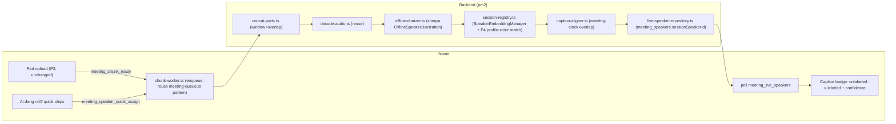

# Near-realtime speaker resolution — design

Sources: [sherpa-onnx node-addon src `non-streaming-speaker-diarization.cc`](https://github.com/k2-fsa/sherpa-onnx/blob/master/scripts/node-addon-api/src/non-streaming-speaker-diarization.cc), [`vad.cc`](https://github.com/k2-fsa/sherpa-onnx/blob/master/scripts/node-addon-api/src/vad.cc), [node example `test_offline_speaker_diarization.js`](https://github.com/k2-fsa/sherpa-onnx/blob/master/nodejs-addon-examples/test_offline_speaker_diarization.js), [`test_vad_microphone.js`](https://github.com/k2-fsa/sherpa-onnx/blob/master/nodejs-addon-examples/test_vad_microphone.js), [speaker-segmentation-models release](https://github.com/k2-fsa/sherpa-onnx/releases/tag/speaker-segmentation-models), [ElevenLabs STT concurrency limits](https://elevenlabs.io/docs/help-center/product/core-capabilities/speech-to-text/how-many-speech-to-text-requests-can-i-make-and-can-i-increase-it), prior report `researcher-260917-1348-*` §A/B/E/F.

**Confirmed via `gh api` source dump (ground truth, not docs prose):** node addon exposes `new sherpa_onnx.OfflineSpeakerDiarization({segmentation:{pyannote:{model,windowShiftRatio}}, embedding:{model}, clustering:{numClusters|threshold}, minDurationOn, minDurationOff})` → `.sampleRate` / `.process(samples: Float32Array) -> segments[]` (each `{start,end,speaker}` per example). Separately `sherpa_onnx.Vad(config, bufferSizeInSeconds)` wraps Silero VAD + `CircularBuffer`, independent of diarization. Both exist in the same npm package already required for P4 (`sherpa-onnx-node`) — no new dependency.

## 1. Chunking strategy

Reuse the **already-uploading part files** (P2's `audio.part-NNNN.webm`, 60s MediaRecorder timeslice) — do not stream a second PCM channel to the backend. This is DRY: same bytes, no new upload path, no new bandwidth.

- **Chunk = 1 part (~60s)**, triggered the moment a part finishes uploading (push, not poll — see §7 `meeting_chunk_ready`).
- **Overlap = last 5-10s of the previous chunk's decoded PCM**, kept in a small in-memory ring buffer per job (10s·16kHz·4B ≈ 640KB, trivial). Prepended to the new chunk before diarizing so a speaker turn spanning the part boundary isn't cut mid-segment and clustering sees continuous context. Segments whose `start` falls inside the overlap region and were already emitted last chunk are discarded (dedupe by `start >= overlapSec`).
- **30s vs 60s trade-off**: 30s halves latency-to-label (~35-45s vs ~65-75s, §5) but doubles chunk-processing calls and gives the clustering step less context per speaker turn — worse for short interruptions typical in VN meetings. 60s rides on the existing part cadence (zero new timers) and gives the segmentation model enough context. **Recommend 60s window, 5-8s overlap**, tune down to 45s only if §5 latency test on hodao proves too slow.
- **ElevenLabs per-chunk overhead** (for ranking in §2): file min 100ms is a non-issue at 60s chunks. The real constraint is **concurrency, not per-call minimum**: batch STT concurrency caps are tier-based (Free 8, Starter 12, Creator 20, Pro 40, Scale/Business 60, Enterprise custom) — sequential 60 calls/hour per meeting is fine concurrency-wise, but each call still pays full HTTP+model-load latency (~1-3s) 60 times/hour, and exact **per-request price rounding is undocumented** (unconfirmed whether billing rounds up per call vs prorates exactly) — worst case a 60-call/hour pattern costs the same $/audio-hour as one call, best case each call rounds up and costs measurably more. This uncertainty plus stacking cost (see §5) is why option (a) is ranked last for the incremental path.

## 2. Per-chunk diarization engine ranking (CPU-only, 72 cores, no GPU)

| Rank | Engine | Why |
|---|---|---|
| **1** | **sherpa-onnx `OfflineSpeakerDiarization`** (pyannote segmentation-3.0 + reuse P4's embedding model, e.g. 3D-Speaker CAM++ zh_en) | Confirmed Node API. Reuses the **same embedding extractor already mandatory for P4** (DRY — one model, one ONNX session, one licence chain: sherpa-onnx wrapper Apache-2.0, pyannote segmentation-3.0 redistributed un-gated on sherpa-onnx's own GitHub release, unlike the HF-gated original). Zero external latency variance, zero recurring $. Segmentation model is small (CNN+LSTM, few MB) — expect well under real-time on a single CPU core; total chunk cost dominated by embedding extraction per detected segment, still small models. Correctly detects speaker-turn boundaries (this is literally what the model is for), better than VAD-only at fast back-and-forth. **Newer/less battle-tested Node API path** — must be validated on real VN+EN samples before relying on it (P4's calibration script already plans this class of validation). |
| 2 | Silero VAD (sherpa-onnx `Vad`) + per-turn embedding (P4 extractor) + online clustering via `SpeakerEmbeddingManager.add/search` | Simplest — no diarization-model dependency at all, only components already needed elsewhere (VAD is trivial CPU cost, embedding reused from P4, clustering reuses the exact `add/search(threshold)` API already used for voiceprint matching). **Weaker at overlapping/interrupting speech** — VAD segment boundaries aren't speaker-aware, so a quick interjection mid-turn can get absorbed into the wrong speaker's segment. Good **v1 fallback** if the offline-diarization Node API proves unstable in testing — same downstream registry code (§3) works unchanged since both paths ultimately produce `(segment, embedding)` pairs. |
| 3 | ElevenLabs batch `diarize=true` per chunk | Cost stacks on top of the realtime-caption bill already running for this meeting (§5), external network dependency for every chunk (already required for captions, but now on the critical path for labels too), concurrency-limit exposure at scale (many simultaneous meetings), rounding risk (§1). Reserve **only** for the existing final authoritative full-file pass (already planned in P3) — do not use per-chunk. |

**Recommendation**: build on (1), keep (2) as the documented fallback path if the diarization Node binding misbehaves in the P4-style calibration run.

## 3. Global speaker registry (session-local + persistent)

Per-chunk labels are local (`speaker_0` in chunk 3 ≠ chunk 4) even with clustering, because each `OfflineSpeakerDiarization.process()` call clusters only within that chunk's audio. Two-tier registry, in-memory for the session (not persisted mid-meeting):

1. **Session registry** — one `sherpa_onnx.SpeakerEmbeddingManager(dim)` instance per active job (confirmed API: `.add(name, embedding)`, `.search(embedding, threshold) -> name`, `.verify`). For each chunk-local segment's embedding: `search()` against session registry first (looser threshold, e.g. 0.35-0.45 cosine — same room/mic/session has less variability than cross-meeting matching) → hit gives stable `sessionSpeakerId`; miss → `add()` a new `sessionSpeakerId = "s" + (count+1)`.
2. **Persistent match** — throttled (not every chunk; e.g. once a session speaker accumulates ≥`SPEAKER_MIN_SEGMENT_SEC` new speech since last check) run the **same** `matchSpeaker()`/cosine code already built for P4 against profiles loaded once at job start and cached in memory (avoid a DB round-trip per chunk). Emits `profileId` + `displayName` + `confidence` alongside `sessionSpeakerId`.
3. **Merge/split**: keep session threshold stricter for *merging* than for matching — only collapse two `sessionSpeakerId`s when a later chunk's centroid similarity to another session speaker's rolling centroid exceeds a higher merge-threshold (e.g. 0.6). On merge: relabel retroactively — every caption line/segment already tagged with the losing `sessionSpeakerId` gets remapped (client re-renders by id, no destructive text rewrite, matches P4's non-destructive relabeling pattern via `meeting_relabel_speaker`). Splits (one `sessionSpeakerId` turning out to be two people) are **not auto-detected** in v1 — surface via the "Ai đang nói?" quick-assign (§7) for manual correction, same as P4's `speaker_resolve` `mode:'merge'`.
4. **Cold start**: unknown speaker with no profile match → `"Người nói N"` (N = running distinct-session-speaker count), consistent with P4's existing i18n convention for unresolved speakers.
5. **Minimum speech before label shown**: reuse `SPEAKER_MIN_SEGMENT_SEC` (already an env var from P4) — a session speaker with less than that much accumulated speech stays unlabeled ("Đang nói" neutral badge) to avoid flapping labels on noise/breath blips.

## 4. Alignment to captions — one meeting clock

Per phase-02, PCM (AudioWorklet) and storage (MediaRecorder) both read the **same `MediaStream`**, but they are two independent consumers with separate internal timestamping — `AudioContext.currentTime` starts at worklet-node creation, `MediaRecorder`'s internal clock starts at `.start()` — these calls happen a few ms to potentially 100ms+ apart in the JS event loop, and neither browser API guarantees frame-accurate cross-consumer sync. WebM timeslice blob boundaries are also not spec-guaranteed frame-continuous (Chrome is usually fine in practice, but treat as ±1-2s-jitter-tolerant, not exact).

**Fix**: define meeting clock = ms since a single client-side `recordingEpochMs = performance.now()` captured once, synchronously, immediately before calling `mediaRecorder.start(PART_MS)` and wiring the AudioWorklet node (same tick). All downstream timestamps convert to this epoch:
- **Caption `atSec`**: computed client-side as `(performance.now() - recordingEpochMs)/1000` when each `COMMITTED_TRANSCRIPT` event arrives — do **not** trust ElevenLabs' own realtime timestamps, which are relative to WS-connect time, not `recordingEpochMs` (WS connects after a token-mint round trip, seconds after recording start).
- **Chunk-diarization segments**: relative to chunk start. `chunkStartSec` must be the **sum of actual decoded durations** of prior parts (from ffmpeg, same pattern as `decode-audio.ts`'s duration parse), not `seq * 60` nominal — MediaRecorder timeslice duration jitters.
- **Attach**: for each committed caption line `[startSec,endSec]` (meeting clock), find the diarization segment(s) in that chunk (offset by `chunkStartSec`) with **max overlap-seconds**; assign that segment's `sessionSpeakerId`. Ties → longest overlap wins. Attachment happens ~60-90s after the chunk's speech occurred (§5) — caption line transitions from neutral to labeled badge in place, never rewriting rendered text.

## 5. Latency & cost budget

**Chunk=60s, per boundary**: part already uploading (existing P2 flow, ~1-3s) → `meeting_chunk_ready` fires chunk worker → download+concat window (reuse `concat-parts.ts` pattern, ~0.5-1s) → decode webm→wav16k (`@ffmpeg-installer/ffmpeg`, ~1-2s for 60s audio) → offline diarization `.process()` (small CPU models, expect ~1-3s) → registry match (<1s, in-memory) → write + emit → iframe poll `meeting_live_speakers` (3-5s cycle). **Total ≈ 60s wait-for-chunk-close + 5-10s processing + ≤5s poll ≈ 70-80s speech-to-label-on-screen.** Chunk=30s: ≈ 35-45s (half the wait, same processing floor, 2x more chunk calls).

**CPU cost/hour on hodao (72 cores)**: 60 chunks/hour × ~2-5s CPU each ≈ 2-5 CPU-minutes/hour of meeting — negligible, sub-10% of one core averaged; self-hosted diarization is effectively free compute here.

**$/h ElevenLabs-per-chunk variant** (if chosen against §2 recommendation): 60 calls/hour billed for the audio they cover — if billing prorates exactly, nominal cost ≈ same $0.22/h as one full batch call, **but stacks on top of the realtime captions already running ($0.39/h)** → ≈ $0.61/h combined, **plus** the existing P3 final authoritative batch pass ($0.22/h again) → up to **~$0.83/h** total ElevenLabs spend if chunk-diarize is added without removing anything else. Rounding-per-call risk (§1) could push this higher; unverified, flag before committing budget.

**Self-hosted variant**: only cost stays the pre-existing realtime-caption $0.39/h (unchanged plan cost); chunk diarization adds ~$0 marginal API/compute cost. **Self-hosted is strictly cheaper and removes concurrency/rate-limit exposure** — reinforces §2's ranking.

## 6. Final pass reconciliation

**Keep P3 unchanged**: after "End & summarize", still run the one full-file ElevenLabs batch `diarize=true` (authoritative) — this remains the source of truth for saved transcript/summary; QĐ-01 is not affected by this design.

**Reconcile**: map ElevenLabs' final per-word `speaker_id` segments (native meeting-clock, single full-file call) against the live session labels using the exact same max-overlap logic as §4's caption-attachment → produces `finalSpeakerId -> {sessionSpeakerId, profileId?, displayName?}`. The **P3/P4 authoritative match wins** for the stored transcript/summary (unchanged `resolveSpeakers` logic) — live session labels only drove the UI during recording and are informative, not authoritative, so there is exactly one source of truth for saved data.

**Criteria to consider making the final pass self-hosted too** (not v1, future option only — flag to user, do not decide unilaterally per user-decision rule): (i) sherpa-onnx offline diarization's speaker-purity/DER on ≥5 real VN+EN meetings (calibration script analogous to `calibrate-speaker-threshold.ts`) is within ~2-3 points of ElevenLabs `diarize=true`; (ii) it handles VN meetings' overlapping/interruption style at least as well; (iii) recurring $0.22/h cost becomes a real driver; (iv) team accepts a **much bigger** change than it sounds — self-hosted diarization does **not** do ASR, so a fully self-hosted final pass means re-attaching diarization segments to the **realtime caption words** instead of ElevenLabs' batch `words[]`, i.e. dropping the batch STT call entirely, not just its diarization flag. VN realtime-caption WER vs batch `scribe_v2` WER is unverified — **do not recommend this switch for v1**; self-hosted diarization stays scoped to the incremental/live path only.

## 7. Architecture, modules, tools, UI, phase impact



**New modules** (`src/server/live-speakers/`, kebab-case, all new):
- `chunk-worker.ts` — enqueue on `meeting_chunk_ready`, orchestrates concat(window+overlap)→decode→diarize→match→align→persist; reuses `meeting-queue.ts`'s `RenderQueue`/`AbortController`/heartbeat pattern (one queue instance, separate from the P3 full-job queue, keyed by `meetingId`).
- `offline-diarizer.ts` — lazy singleton wrapping `sherpa_onnx.OfflineSpeakerDiarization`, loads pyannote-segmentation-3.0 + reuses `SPEAKER_MODEL_PATH` from P4.
- `session-registry.ts` — per-meeting in-memory `SpeakerEmbeddingManager`, merge/split logic (§3), throttled profile-store lookup.
- `caption-aligner.ts` — meeting-clock math + max-overlap attach (§4), shared by both live-labeling and §6 final reconciliation.
- `live-speaker-repository.ts` — extends existing `meeting_speakers` (add field `sessionSpeakerId`, no new collection — DRY, avoids schema bloat) via `AppDbBotClient`.
- `tools/chunk-ready-tool.ts` (`meeting_chunk_ready {roomId, meetingId, seq}`, owner-only, fire-and-forget ack `{accepted:true}`) — pushed by iframe right after each part upload succeeds, replacing backend polling of `partCount` for lower latency.
- `tools/live-speakers-tool.ts` (`meeting_live_speakers {roomId, meetingId}` → `{ sessionSpeakers: [{sessionSpeakerId, displayName?, profileId?, confidence?, colorKey}], captionSpeakerMap: [{captionId, sessionSpeakerId}] }`, polled every 3-5s like `meeting_status`).
- `tools/quick-assign-tool.ts` (`meeting_speaker_quick_assign {roomId, meetingId, sessionSpeakerId, mode:'user'|'name'|'merge'}` — mid-meeting version of `speaker_resolve`, owner-only, same enrol/merge code path).

**Pseudocode — chunk worker**:
```ts
async function onChunkReady(meetingId, seq) {
  if (inFlight.has(meetingId)) return enqueueNext(meetingId, seq);
  const parts = await listPartsWindow(meetingId, seq, WINDOW_PARTS);       // e.g. last 1 part
  const wav = await decodeToWav16k(await concatWithOverlapTail(parts, ring.get(meetingId)));
  const segments = diarizer.process(wav.samples);                          // sherpa-onnx
  ring.set(meetingId, wav.tailPcm(OVERLAP_SEC));
  for (const seg of segments) {
    if (seg.start < OVERLAP_SEC && alreadyEmitted(meetingId, seg)) continue;
    const emb = extractEmbedding(wav, seg);                                 // P4 extractor, reused
    const sessionId = registry.matchOrAdd(meetingId, emb);
    const profileMatch = shouldCheckProfile(meetingId, sessionId) ? matchSpeaker(emb, profiles) : null;
    await liveSpeakerRepo.upsert(meetingId, sessionId, profileMatch, seg.toMeetingClock(chunkStartSec));
  }
  await alignCaptions(meetingId);                                           // caption-aligner.ts
}
```

**Pseudocode — registry match/merge** (§3):
```ts
function matchOrAdd(meetingId, emb) {
  const found = sessionManager(meetingId).search(emb, SESSION_MATCH_THRESHOLD);
  if (found) { maybeMerge(meetingId, found, emb); return found; }
  const id = `s${nextIndex(meetingId)}`;
  sessionManager(meetingId).add(id, emb);
  return id;
}
function maybeMerge(meetingId, id, emb) {
  const centroid = rollingCentroid(meetingId, id);
  for (const other of otherSpeakers(meetingId, id))
    if (cosine(centroid, other.centroid) > MERGE_THRESHOLD) relabelRetroactive(meetingId, id, other.id);
}
```

**UI behaviour**: caption line starts with neutral "Đang nói" badge (unchanged from P2). Once `meeting_live_speakers` poll reports a `sessionSpeakerId` covering that line's time range, badge transitions (fade/slide, no text rewrite) to a colored name chip (`colorKey`) + small confidence dot (check icon if profile-matched above threshold, "?" if session-only/no profile — tapping "?" opens the same quick-assign as the floating "Ai đang nói?" control). The floating control shows chips for all currently-active `sessionSpeakerId`s (running distinct count), tap-to-rename calls `meeting_speaker_quick_assign`, optimistic local relabel confirmed by next poll.

**Phase-impact list** (flag to user — this is new scope, needs approval, not silently absorbed into existing effort estimates):
- **P2** (+0.5-1d): add `meeting_chunk_ready` call after each part upload; caption-line model gains `sessionSpeakerId?/colorKey?/confidence?`.
- **P3** (+0.5d): factor `concat-parts.ts`/`decode-audio.ts` for windowed reuse (mostly already reusable); add final-pass reconciliation step (§6) using `caption-aligner.ts`.
- **P4** (largest delta, **+3-4d**): all of §7's new modules, model download (pyannote-segmentation-3.0, checksummed) + calibration extending `calibrate-speaker-threshold.ts`'s method to session-threshold/merge-threshold, 3 new tools + manifest + tests. Recommend splitting into a new **Phase 4b: near-realtime speaker resolution** (3-4d) inserted after current P4, dependency P3+P4.
- **P6** (negligible): optionally show a "resolved live" provenance badge in history; no structural change since saved data still comes from the P3/P4 authoritative pass.
- **P7** (+0.5d): add pyannote-segmentation model to deploy/checksum script; add a 60-min soak test for chunk-worker CPU/memory on hodao.
- **Net delta: ~+5-6d on top of the current 22d plan.**

## Unresolved questions

1. ElevenLabs per-request billing rounding/granularity for many small (~60s) `convert()` calls is undocumented — needed only if §2's option (a) is ever reconsidered; not needed for the recommended self-hosted path.
2. sherpa-onnx `OfflineSpeakerDiarization` CPU wall-clock on a 60s chunk is not benchmarked here (no official numbers published) — must measure on hodao before committing to 60s vs 30s chunking; recommend doing this alongside P4's existing embedding-model calibration pass.
3. Exact `OfflineSpeakerDiarization.process()` output segment shape confirmed only via the printed example (`{start,end,speaker}`), not a typed doc — verify field names against the actual npm package version pinned in `package.json` before coding against it.
4. Session-merge threshold (0.6 suggested) and session-match threshold (0.35-0.45 suggested) are starting points, not calibrated — same caveat as P4's `SPEAKER_MATCH_THRESHOLD`, needs the same empirical calibration on real VN+EN recordings.
5. Whether WebM MediaRecorder timeslice boundaries on the target browser(s) ever actually drop samples (vs just non-guaranteed-continuous per spec) is unverified — affects how much overlap margin (5s vs 10s) is truly safe.

Status: DONE
Summary: Chunk on existing 60s part uploads (no new stream) with 5-8s overlap; self-hosted sherpa-onnx OfflineSpeakerDiarization (reusing P4's embedding model) ranked above VAD+clustering and above per-chunk ElevenLabs (which stacks cost/latency/concurrency risk on top of already-running realtime captions); two-tier in-memory session registry + P4 profile-store gives stable sessionSpeakerId with retroactive merge; single client-side recordingEpochMs unifies AudioWorklet/MediaRecorder/ElevenLabs timestamps; ElevenLabs full-file batch pass stays authoritative and unchanged, reconciled against live labels by max-overlap.
Concerns/Blockers: net effort +5-6d (new Phase 4b) needs user approval before scheduling; several thresholds/benchmarks (Q2-Q4) require empirical calibration on hodao before committing to 60s vs 30s and threshold defaults.
